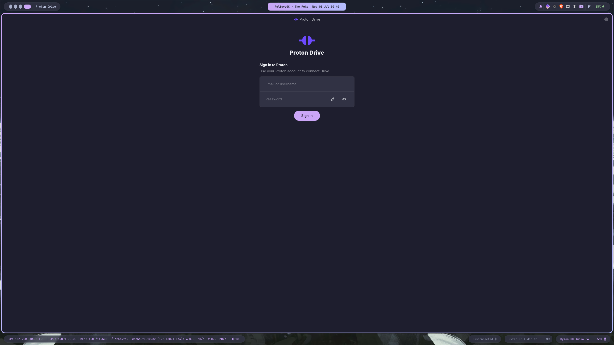
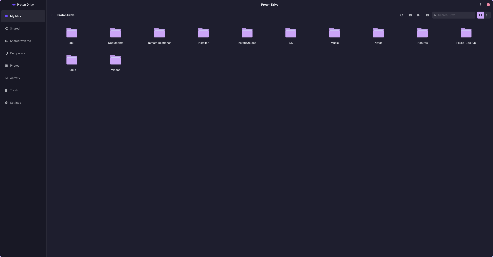
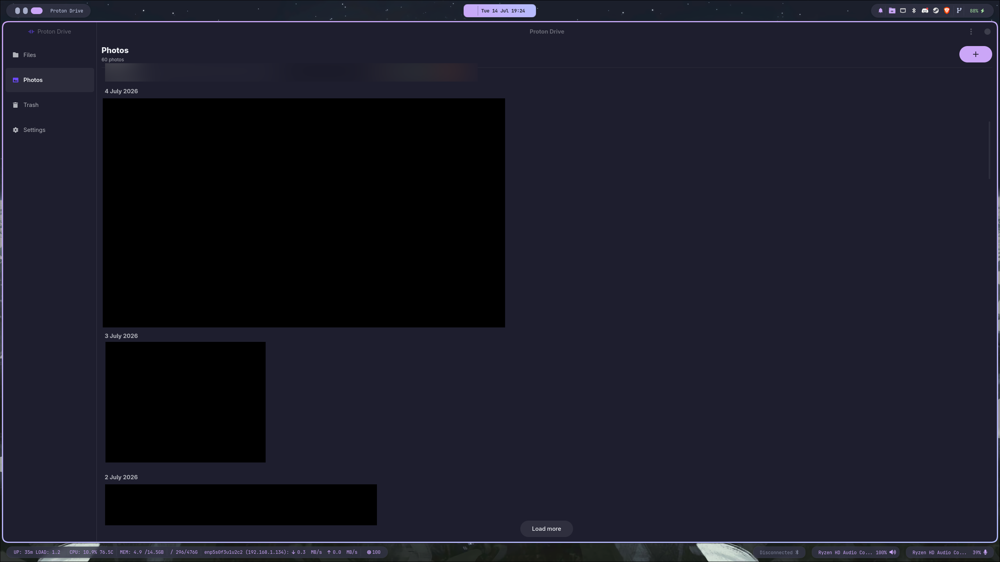
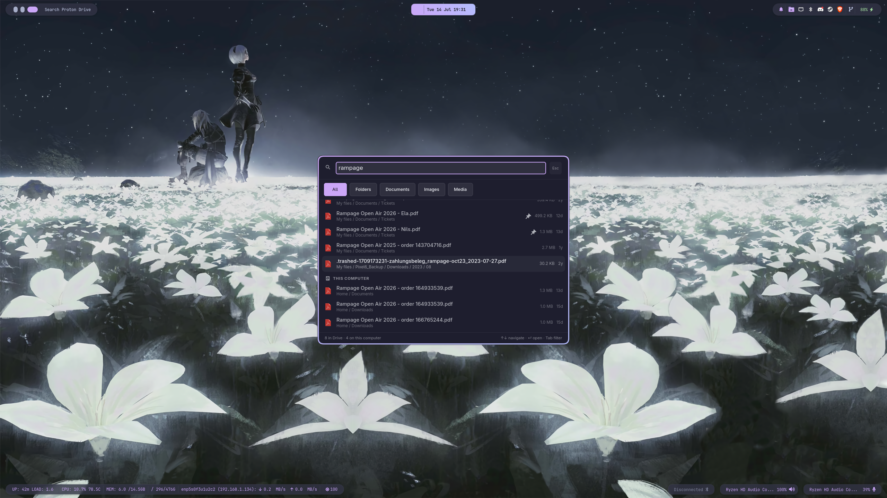
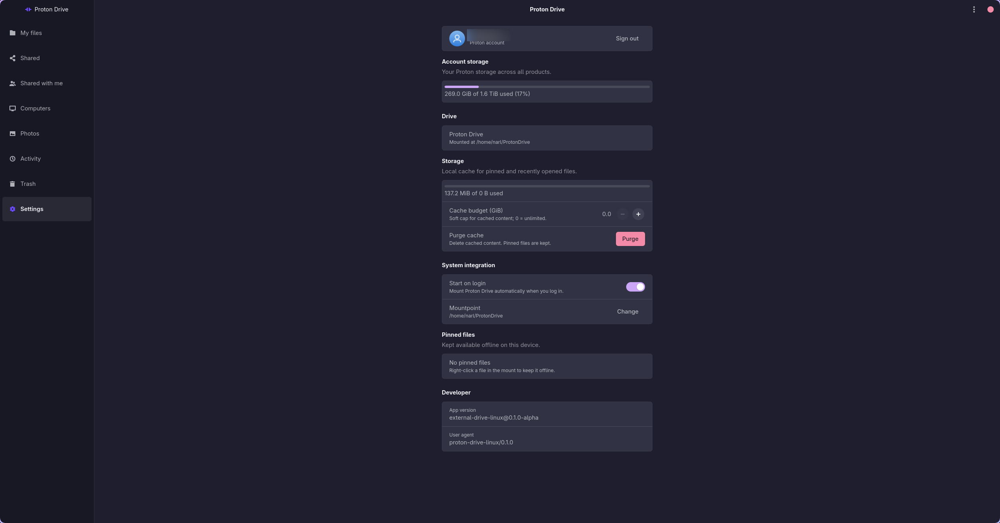

# Proton Drive client for Linux (unofficial)

A fast, unofficial Proton Drive client for Linux. This client features an advanced files-on-demand FUSE virtual mount with block-level caching, a command-line interface (CLI), and a fully non-blocking GTK4 desktop application with system tray integration.

## Features

- **Files-on-Demand (FUSE)**: Mount your Proton Drive as a virtual filesystem where files are downloaded only when opened, utilizing smart block-level caching and disk-backed writes.
- **Command-Line Interface (CLI)**: Manage your drive, authenticate, and monitor sync status directly from the terminal.
- **Non-Blocking GTK4 Desktop App**: Browse files, manage pins, and configure options through a modern, native GUI with a fully non-blocking asynchronous main loop.
- **System Tray Integration**: Background indicator for status monitoring, quick actions, and fast sync controls.
- **Fuzzy Search Launcher Prompt (HUD)**: A Google Drive-style search launcher (`pdfs-prompt`) for finding and opening files or folders instantly, ideal for binding to a system-wide hotkey.
- **Secure Credential Storage**: Integrates with the system Secret Service (GNOME Keyring, KWallet, etc.) with smart in-memory credential caching to avoid UI thread blockages.
- **Proton Photos Support**: Access your Proton Photos timeline, view thumbnails, and download backed-up media natively (available in the GUI as a navigation tab and via the CLI).
- **Human Verification (CAPTCHA) Recovery**: Detects sign-in gates (VPN/new IP challenges) and launches an embedded `WebKitWebView` dialog to safely complete the challenge, transparently retrying authentication with the earned token.
- **Selective Sync (`.pdfsignore`)**: Keep build trees, dependency directories, and editor leftovers out of synced folders using gitignore-style rules.

## Selective Sync (`.pdfsignore`)

Two-way synced folders skip paths matched by ignore rules, so syncing a project
directory does not upload `node_modules/`, `target/`, or `.git/`.

Rules come from two places, and both apply:

1. **Per folder** — a `.pdfsignore` file at the root of the synced folder
   (`.protonignore` also works). Gitignore syntax, including negation:

   ```gitignore
   # everything build-related
   build/
   *.log

   # ...except this one
   !important.log
   ```

2. **Globally** — an `ignore_patterns` list in `config.json`, applied to every
   synced folder. When unset, sensible defaults apply: `.git/`, `.hg/`, `.svn/`,
   `node_modules/`, `target/`, `.venv/`, `__pycache__/`, `*~`, `*.swp`, `*.tmp`,
   `.DS_Store`, and `Thumbs.db`.

   ```json
   {
     "ignore_patterns": ["node_modules/", "target/", "*.iso"]
   }
   ```

   Set it to `[]` to opt out of the defaults entirely.

Rules are re-read at the start of every sync pass, so edits take effect on the
next pass without restarting the daemon.

**Ignoring is never destructive.** If a rule starts matching a file that was
already synced, its copy on Drive is left untouched — the file simply stops
being tracked. Removing the rule later picks the existing remote file back up
rather than re-uploading it.

## Performance & Caching

The client includes several optimizations designed for high efficiency, a low memory footprint, and a responsive user experience:

- **On-Demand Block Cache**: Files are read in fixed 4 MiB blocks. For unpinned files, the client fetches and caches only the blocks containing the requested byte ranges. This enables fast sequential and sparse reads (e.g. media streaming or metadata scanning) without downloading entire files.
- **Disk-Backed Writes**: Large file writes are staged on disk in temporary scratch files (rather than fully buffered in RAM) and track modified byte intervals. Only the unedited remote segments are fetched at commit time, keeping memory usage minimal.
- **Non-Blocking GTK4 Loop**: To prevent UI freezes, all synchronous D-Bus credential checks, control socket requests, and cache usage calculations are offloaded to background worker threads or fetched asynchronously.
- **Flicker-Free UI Rendering**: The GTK4 application performs differential rendering of the pins list, only modifying list rows when the list content changes, preserving the user's scroll position and widget focus.


## Screenshots

### GUI Application & Launcher

<table>
  <tr>
    <td align="center" width="50%"><br><sub><b>Login Screen</b></sub></td>
    <td align="center" width="50%"><br><sub><b>Files Browser</b></sub></td>
  </tr>
  <tr>
    <td align="center" width="50%"><br><sub><b>Photos Timeline</b></sub></td>
    <td align="center" width="50%"><br><sub><b>Search Launcher Prompt</b></sub></td>
  </tr>
  <tr>
    <td align="center" colspan="2"><br><sub><b>Settings</b></sub></td>
  </tr>
</table>

---

## Prerequisites

To compile the application from source or run the built binaries, ensure you have the following system libraries installed on your distribution:

### Ubuntu / Debian (24.04+)
```bash
sudo apt-get update
sudo apt-get install -y \
  pkg-config \
  libfuse3-dev \
  libgtk-4-dev \
  libadwaita-1-dev \
  libwebkitgtk-6.0-dev \
  libsecret-1-dev \
  libdbus-1-dev
```

### Arch Linux
```bash
sudo pacman -S --needed pkgconf fuse3 gtk4 libadwaita libsecret dbus webkitgtk-6.0
```

### Fedora (44+)
```bash
sudo dnf install -y \
  pkgconf-pkg-config fuse3-devel gtk4-devel libadwaita-devel \
  webkitgtk6.0-devel libsecret-devel dbus-devel glib2-devel cargo rust
```

Runtime extras (pick your desktop):
```bash
# GNOME — keyring + tray (AppIndicator)
sudo dnf install -y gnome-keyring gnome-shell-extension-appindicator xdg-utils

# KDE Plasma — KWallet (Secret Service); tray works via built-in SNI
sudo dnf install -y kwallet xdg-utils
```

---

## Building from Source

Ensure you have Rust and Cargo installed (minimum supported Rust version is 1.96).

1. Clone the repository and navigate into the project directory:
   ```bash
   git clone https://github.com/narl/proton-drive-linux.git
   cd proton-drive-linux
   ```
2. Build the workspace in release mode:
   ```bash
   cargo build --release --locked
   ```

The compiled binaries will be available under `target/release/`:
- `pdfs`: The CLI utility.
- `pdfs-app`: The GTK4 application.
- `pdfs-tray`: The tray status notifier.
- `pdfs-prompt`: The launcher prompt for quick HUD search.

---

## Installation & Packages

### 1. Debian / Ubuntu (.deb)
Install the debian package via `dpkg` or `apt`:
```bash
sudo apt install ./proton-drive-linux_*.deb
```

### 2. Arch Linux
A local `PKGBUILD` is available under the `packaging/` directory. You can build and install it using:
```bash
cd packaging && makepkg -fi
```

### 3. Fedora (local RPM)
A local `.spec` is available under `packaging/`. From the repository root:
```bash
sudo dnf install -y rpm-build
rpmbuild -bb packaging/proton-drive-linux.spec \
  --define "git_dir $PWD" \
  --define "_rpmdir $PWD/packaging/out" \
  --define "_builddir $PWD/packaging/build" \
  --define "_sourcedir $PWD" \
  --define "_specdir $PWD/packaging" \
  --define "_srcrpmdir $PWD/packaging/out"
sudo dnf install packaging/out/x86_64/proton-drive-linux-*.rpm
```

---

## Automated Releases (CI/CD)

This project has a GitHub Actions CI workflow configured under `.github/workflows/release.yml`.

### How it works:
1. **Triggers**: 
   - Pushing a git tag matching `v*` (e.g. `git tag v0.1.0 && git push origin v0.1.0`).
   - Manual runs via the **Actions** tab in GitHub (**workflow_dispatch**).
2. **Build Process**:
   - Spawns an Ubuntu runner and installs GTK4, Libadwaita, FUSE3, and Secret Service packages.
   - Sets up the Rust compiler and caches build targets to speed up runs.
   - Compiles the workspace members in release mode.
3. **Artifact Packaging**:
   - Generates a `.tar.gz` containing the raw binaries (`pdfs`, `pdfs-app`, `pdfs-tray`, `pdfs-prompt`).
   - Packs them into a Debian package (`.deb`).
4. **Publishing**:
   - Creates a GitHub Release matching the pushed tag and uploads the `.deb` and `.tar.gz` packages as release assets.
   - For manual runs, compiles and exposes the packages as workflow run artifacts for testing.

---

## License

This project is licensed under the [MIT License](LICENSE).
