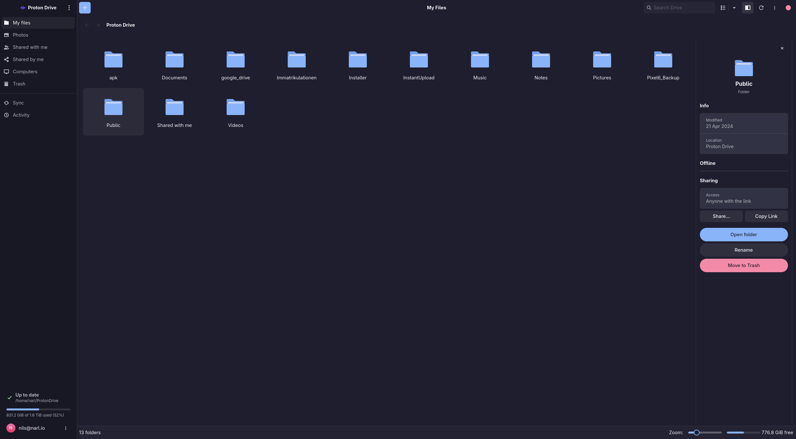
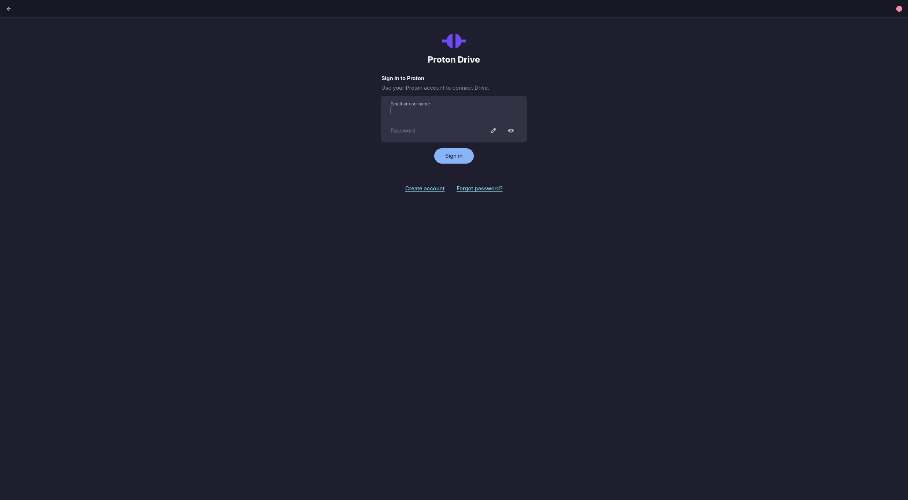
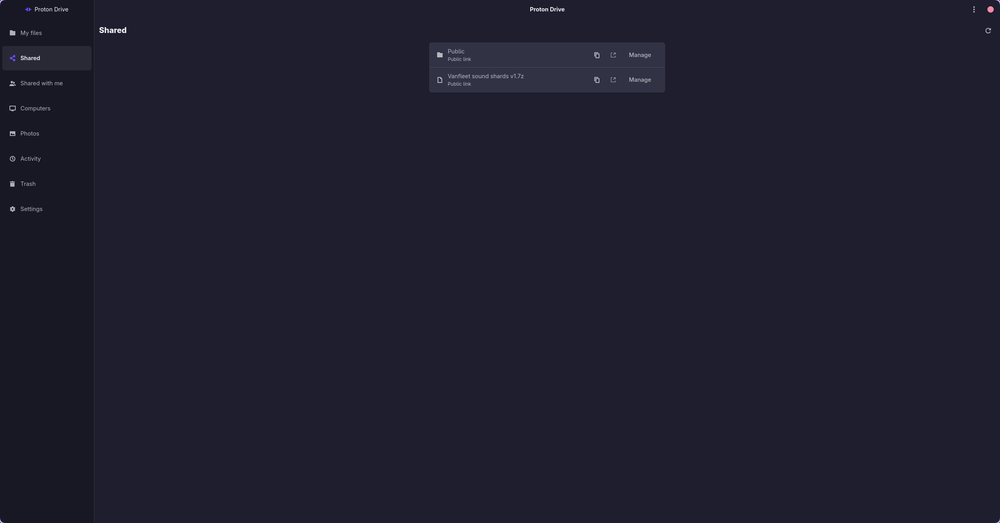
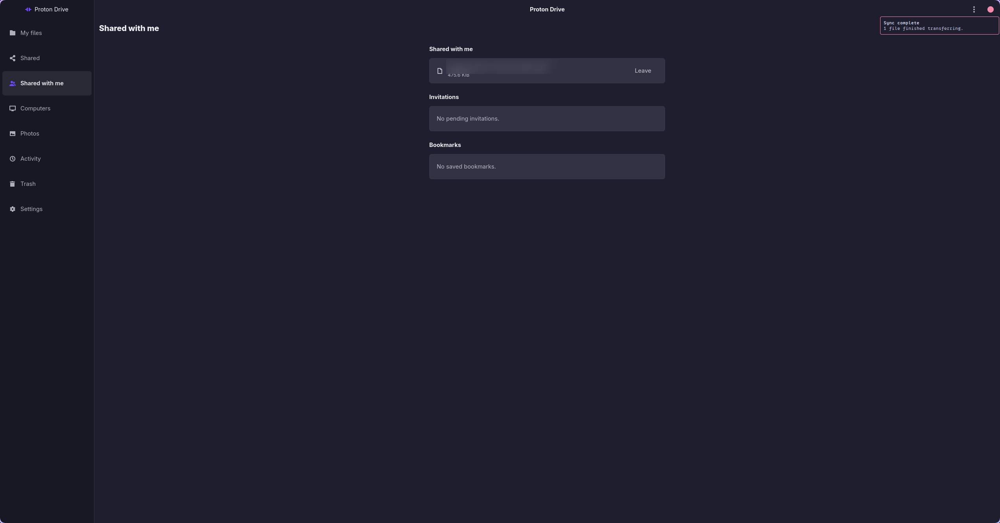
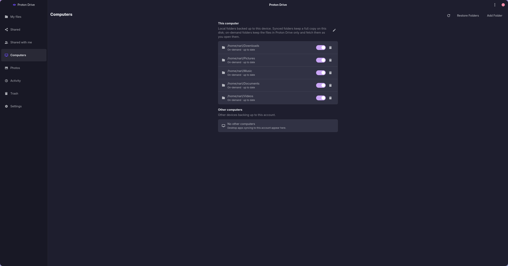
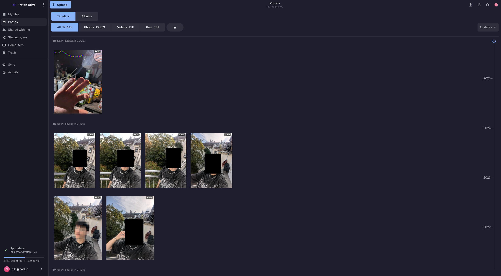
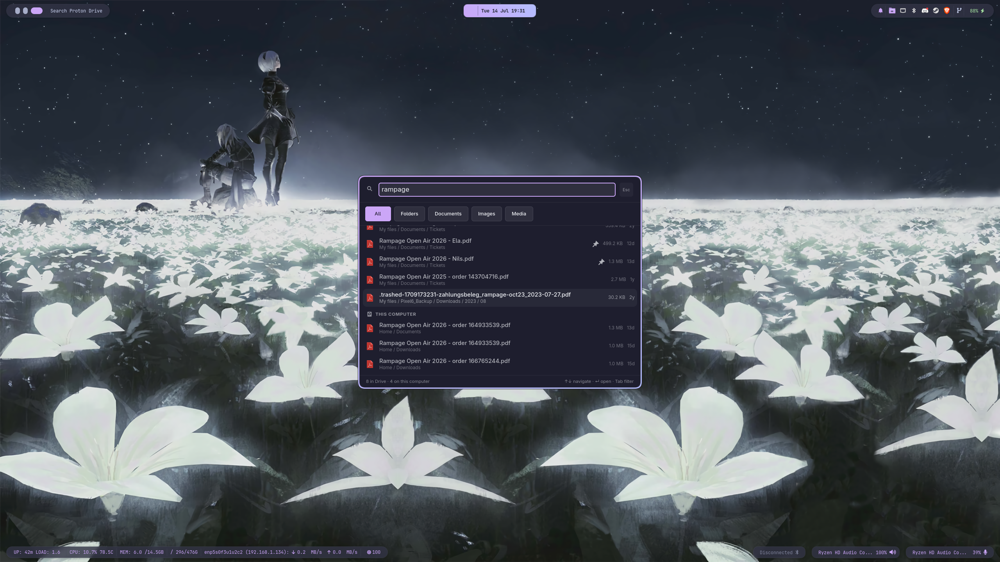
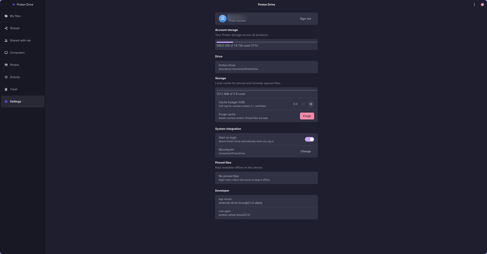

<div align="center">


# Proton Drive for Linux

**Files-on-demand Proton Drive for the Linux desktop** — a FUSE virtual mount with block-level
caching, a scriptable CLI, and a native GTK4 app with tray and search launcher.

[](https://github.com/narrrl/proton-drive-linux/actions/workflows/ci.yml)
[](https://github.com/narrrl/proton-drive-linux/releases/latest)
[](LICENSE)
[](https://www.rust-lang.org)
[](#prerequisites)



</div>

> [!IMPORTANT]
> This is an **unofficial**, community-built client. It is not affiliated with, endorsed by, or
> supported by Proton AG. "Proton" and "Proton Drive" are trademarks of Proton AG, used here only
> to describe what the software talks to. Use a test account first, and read
> [`docs/RECOVERY.md`](docs/RECOVERY.md) before trusting it with data you cannot lose.

## Install

```bash
# Debian / Ubuntu
sudo apt install ./proton-drive-linux_*.deb

# Fedora
sudo dnf install ./proton-drive-linux-*.rpm

# Arch Linux
cd packaging && makepkg -fi
```

Packages for each release are attached to the [latest
release](https://github.com/narrrl/proton-drive-linux/releases/latest); see
[Installation & Packages](#installation--packages) for details and
[Building from Source](#building-from-source) to compile it yourself.

```bash
pdfs login          # sign in (SRP + 2FA, credentials go to the system keyring)
pdfs status         # mount state, queued writes, cache usage
pdfs-app            # the desktop app
```

## Contents

- [Features](#features) · [Quick search](#quick-search-and-media-opening) · [Opening files](#choosing-how-files-open)
- [Selective sync](#selective-sync-pdfsignore) · [Diagnostics](#diagnostics--maintenance) · [Scripting](#scripting---json)
- [Performance](#performance--caching) · [Filesystem safety](#filesystem-safety) · [Screenshots](#screenshots)
- [Prerequisites](#prerequisites) · [Building](#building-from-source) · [Packages](#installation--packages) · [Releases](#automated-releases-cicd)

**Documentation:** [Architecture](docs/ARCHITECTURE.md) · [Testing](docs/TESTING.md) ·
[Recovery](docs/RECOVERY.md) · [Development](docs/DEVELOPMENT.md) ·
[Known issues](docs/BUGS.md) · [Changelog](docs/CHANGELOG.md) ·
[Contributing](CONTRIBUTING.md) · [Security policy](SECURITY.md)

## Features

- **Files-on-Demand (FUSE)**: Mount your Proton Drive as a virtual filesystem where files are downloaded only when opened, utilizing smart block-level caching and disk-backed writes.
- **Command-Line Interface (CLI)**: Manage your drive, authenticate, and monitor sync status directly from the terminal.
- **Non-Blocking GTK4 Desktop App**: Browse files, manage pins, configure options, and monitor active transfers through a modern, native GUI with a fully non-blocking asynchronous main loop.
- **File Thumbnails**: Browse locally cached image previews in Files, Shared, and Trash, including embedded previews from camera RAW files. Build a whole folder tree from the Files toolbar and resize the grid from the status bar.
- **Shared Links & Invites**: Browse files shared with you by other users, and view/manage your own public shared links directly in the GUI.
- **Local Backup (Computers)**: Sync and back up local directories (like Downloads, Documents, Pictures, etc.) directly to your Proton Drive account.
- **Locations**: One page (and `pdfs locations`) listing every place Proton Drive occupies on this machine — the main mount plus each backed-up folder — with its mode, sync state, and whether it is read-only. Switching a folder between a full local copy and on-demand happens here.
- **System Tray Integration**: Background indicator for status monitoring, quick actions, and fast sync controls.
- **Unified Search Launcher (HUD)**: A resident Google Drive-style launcher (`pdfs-prompt`) that searches Proton Drive and local files together, ranks the best matches, tolerates abbreviations and typos, and is ideal for a system-wide hotkey.
- **Secure Credential Storage**: Integrates with the system Secret Service (GNOME Keyring, KWallet, etc.) with smart in-memory credential caching to avoid UI thread blockages.
- **Proton Photos Support**: Access your Proton Photos timeline, view thumbnails, and download backed-up media natively (available in the GUI as a navigation tab and via the CLI).
- **File Version History**: Every revision Proton Drive still holds for a file, from the browser's details pane (**Versions**) or `pdfs versions list|restore|save|rm`. Restoring is server-side — no re-upload — and an old version can be written out to a local file without touching the live one.
- **Photo Favourites**: Star a photo in the lightbox, filter the gallery to favourites, or use `pdfs favorite <uid>` / `pdfs photos --favorites`.
- **Photo Albums**: Browse your albums — including the ones shared with you — from the Albums view of the Photos page, or with `pdfs albums` / `pdfs album <uid>`. Album contents open in the same gallery as the timeline.
- **Human Verification (CAPTCHA) Recovery**: Detects sign-in gates (VPN/new IP challenges) and launches an embedded `WebKitWebView` dialog to safely complete the challenge, transparently retrying authentication with the earned token.
- **Selective Sync (`.pdfsignore`)**: Keep build trees, dependency directories, and editor leftovers out of synced folders using gitignore-style rules.
- **Data-Safe Offline Writes**: Durable scratch/staging files and a transactional pending queue preserve acknowledged writes across network failures and restarts.

## Quick Search and Media Opening

`pdfs-prompt` searches Drive metadata and the local home-directory index in one request. Results are ranked together rather than split by source. Matching is case-insensitive and supports exact names, prefixes, parent paths, multiple terms, punctuation-separated words, ordered abbreviations, common typos, and adjacent transpositions.

The prompt stays resident after its first launch, so invoking the shortcut again reuses and resets the existing window. Drive folders open from the mount. Audio and video results also open through FUSE, allowing media players to seek and request ranges without downloading the entire file first; ordinary Drive files are materialized into the local cache before opening.

### Using your own launcher (fuzzel, rofi, wofi, …)

`pdfs-prompt --dmenu` runs the same search through an external dmenu-style
launcher instead of the built-in window, so the HUD matches the rest of a
tiling-WM desktop:

```bash
pdfs-prompt --dmenu                                   # fuzzel/rofi/wofi/tofi/bemenu/dmenu, whichever is installed
pdfs-prompt --dmenu --menu 'fuzzel --dmenu --width 60'
pdfs-prompt --dmenu --query invoice                   # skip straight to a search
```

A launcher filters a fixed list — it cannot ask for a new one per keystroke — so
searching takes two steps, and the prompt says which step you are on:

- `Search Drive ›` lists your pinned files. Type anything that isn't one of them
  and press Enter to search for it.
- `Drive: invoice ›` lists the results. Enter opens one; typing something else
  and pressing Enter searches again. Escape closes.

`--query` skips the first step. fuzzel and rofi also get file-type icons.

To make an existing keybinding use it without re-binding, and to pin the
launcher command, set them in `config.json`:

```json
{
  "prompt": {
    "mode": "dmenu",
    "menu": ["fuzzel", "--dmenu", "--width", "60"],
    "menu_limit": 50
  }
}
```

`--gtk` overrides `"mode": "dmenu"` for one invocation. A `{prompt}` token
anywhere in `menu` is replaced by the prompt text; without one, the launcher's
own prompt flag is appended.

## Choosing How Files Open

By default every result is handed to `xdg-open`. An `open_with` block in
`config.json` overrides that per file type — for instance opening text in
Neovim inside Alacritty, while everything else still goes to the desktop:

```json
{
  "open_with": {
    "terminal": ["alacritty", "-e"],
    "rules": [
      { "match": ["@text"], "command": ["nvim"], "terminal": true },
      { "match": ["*.png", "*.jpg"], "command": ["imv"] }
    ]
  }
}
```

- `match` takes file-name globs (`*.md`, `notes-*.txt`) or the classes `@dir`,
  `@text`, `@document`, `@image`, `@media`, `@any`. First matching rule wins.
- `command` is argv, not a shell line. A `{}` token is replaced by the path;
  without one the path is appended. `$VAR` tokens expand from the environment,
  so `["$EDITOR"]` follows your editor.
- `"terminal": true` wraps the command in `terminal`. When that is unset, the
  terminal comes from `$PDFS_TERMINAL`, then `$TERMINAL`, then the first known
  emulator on `PATH`; a bare name like `TERMINAL=alacritty` gains the right
  "run this" flag automatically.
- `"default": [...]` replaces `xdg-open` for everything unmatched.

The rules apply to the prompt (both front ends) and to the GTK browser, so a
file opens the same way wherever it was picked. Patterns are matched against the
Drive name — a downloaded file is stored in the cache under its content hash,
which says nothing about its type, so matching that would send everything to
`xdg-open`.

## Selective Sync (`.pdfsignore`)

Two-way synced folders skip paths matched by ignore rules, so syncing a project
directory does not upload `node_modules/`, `target/`, or `.git/`.

Rules come from two places, and both apply:

1. **Per folder** — a `.pdfsignore` file at the root of the synced folder
   (`.protonignore` also works). Gitignore syntax, including negation:

   ```gitignore
   # everything build-related
   build/
   *.log

   # ...except this one
   !important.log
   ```

2. **Globally** — an `ignore_patterns` list in `config.json`, applied to every
   synced folder. When unset, sensible defaults apply: `.git/`, `.hg/`, `.svn/`,
   `node_modules/`, `target/`, `.venv/`, `__pycache__/`, `*~`, `*.swp`, `*.tmp`,
   `.DS_Store`, and `Thumbs.db`.

   ```json
   {
     "ignore_patterns": ["node_modules/", "target/", "*.iso"]
   }
   ```

   Set it to `[]` to opt out of the defaults entirely.

Rules are re-read at the start of every sync pass, so edits take effect on the
next pass without restarting the daemon.

**Ignoring is never destructive.** If a rule starts matching a file that was
already synced, its copy on Drive is left untouched — the file simply stops
being tracked. Removing the rule later picks the existing remote file back up
rather than re-uploading it.

## Diagnostics & Maintenance

When something looks wrong, `pdfs diagnose` checks the installation and prints a
report. It runs without a daemon on purpose — the state worth diagnosing is
usually the state where the daemon will not start:

```console
$ pdfs diagnose
Paths
[ok  ]   state dir: /home/you/.local/state/proton-drive-linux
[ok  ]   database: /home/you/.local/state/proton-drive-linux/cache.db (170.3 MiB)

Account
[ok  ]   keyring session: you@proton.me

Daemon
[ok  ]   daemon responding
[ok  ]   mounted at: /home/you/ProtonDrive
[ok  ]   queued writes: none

No problems found.
```

It exits non-zero if any check fails, so it works in a health-check script.

For the local metadata database and content cache:

| Command | What it does |
|---|---|
| `pdfs cache inspect` | Database size, reclaimable space, per-table row counts, cache usage against budget |
| `pdfs cache inspect --deep` | Also runs SQLite's integrity check — reads every page, so it is slow on a large database |
| `pdfs cache vacuum` | Checkpoints the write-ahead log and compacts the database |
| `pdfs cache clear` | Deletes cached file content, keeping pinned files |

`vacuum` takes a write lock for its duration and needs room for a second copy of
the database while it runs, so it is a deliberate operation rather than
something the daemon does on a timer.

Before a release, run the real-kernel acceptance suite against a dedicated test
account and mount. See [`docs/TESTING.md`](docs/TESTING.md); it includes optional
two-mount convergence checks and confines destructive operations to a fresh
test directory.

## Scripting (`--json`)

Query commands accept a global `--json` flag and emit machine-readable output:

```console
$ pdfs --json sync list | jq '.items[] | select(.state != "idle") | .local_path'
$ pdfs --json cache inspect | jq '.db_reclaimable_bytes'
$ pdfs --json status | jq -r '.mount.mountpoint'
```

Supported on `status`, `ls`, `pins`, `sync list`, `devices list`, `transfers`,
`activity`, and `cache inspect`. Commands that perform an action keep their
human output — a script that needs to know whether one worked has the exit code.

Two things worth relying on:

- **The payload is unwrapped.** Output is `{"items": […]}`, not the daemon's
  internal `{"SyncFolders": {"items": […]}}`, so scripts never name an internal
  variant.
- **Errors still fail.** A daemon-side error prints its JSON body (with a
  machine-readable `kind`) on stdout *and* exits non-zero, so `set -e` and
  `if pdfs …` behave as expected rather than treating a failed lookup as
  success.

## Performance & Caching

The client includes several optimizations designed for high efficiency, a low memory footprint, and a responsive user experience:

- **On-Demand Block Cache**: Files are read in fixed 4 MiB blocks. For unpinned files, the client fetches and caches only the blocks containing the requested byte ranges. This enables fast sequential and sparse reads (e.g. media streaming or metadata scanning) without downloading entire files.
- **Disk-Backed Writes**: Large file writes are staged on disk in temporary scratch files (rather than fully buffered in RAM) and track modified byte intervals. Only the unedited remote segments are fetched at commit time, keeping memory usage minimal.
- **Non-Blocking GTK4 Loop**: To prevent UI freezes, all synchronous D-Bus credential checks, control socket requests, and cache usage calculations are offloaded to background worker threads or fetched asynchronously.
- **Flicker-Free UI Rendering**: The GTK4 application performs differential rendering of the pins list, only modifying list rows when the list content changes, preserving the user's scroll position and widget focus.
- **Durable Staging**: Scratch metadata and staged writes are synced and atomically published before an upload is acknowledged locally. Rapid revisions supersede pending work transactionally.

## Filesystem Safety

Version 1.0 strengthens the boundaries around local-only data and destructive reconciliation:

- Truncate composes with queued revisions, preserving the authoritative prefix and correct zero-filled growth.
- Combined move-and-rename operations are queued durably and tolerate partially completed remote state.
- Session tombstones prevent successfully unlinked entries from reappearing through eventually consistent listings.
- Names are valid UTF-8 and no longer than Linux's 255-byte component limit.
- Incomplete mirror scans are non-destructive, and total-wipe protection covers every non-empty baseline.
- Failed conflict preservation, local deletion, or staging publication does not settle a new baseline or discard the only local copy.
- State, cache, and config directories must be real, current-user-owned `0700` directories; control sockets are `0600`.


## Screenshots

### GUI Application & Launcher

<table>
  <tr>
    <td align="center" width="50%"><br><sub><b>Login Screen</b></sub></td>
    <td align="center" width="50%"><br><sub><b>Files Browser</b></sub></td>
  </tr>
  <tr>
    <td align="center" width="50%"><br><sub><b>Shared Links</b></sub></td>
    <td align="center" width="50%"><br><sub><b>Shared with me</b></sub></td>
  </tr>
  <tr>
    <td align="center" width="50%"><br><sub><b>Local Backups (Computers)</b></sub></td>
    <td align="center" width="50%"><br><sub><b>Photos Timeline</b></sub></td>
  </tr>
  <tr>
    <td align="center" width="50%"><br><sub><b>Search Launcher Prompt</b></sub></td>
    <td align="center" width="50%"><br><sub><b>Settings</b></sub></td>
  </tr>
</table>

---

## Prerequisites

To compile the application from source or run the built binaries, ensure you have the following system libraries installed on your distribution:

### Ubuntu / Debian (24.04+)
```bash
sudo apt-get update
sudo apt-get install -y \
  pkg-config \
  libfuse3-dev \
  libgtk-4-dev \
  libadwaita-1-dev \
  libwebkitgtk-6.0-dev \
  libsecret-1-dev \
  libdbus-1-dev \
  libimage-exiftool-perl
```

### Arch Linux
```bash
sudo pacman -S --needed pkgconf fuse3 gtk4 libadwaita libsecret dbus webkitgtk-6.0 perl-image-exiftool
```

### Fedora (44+)
```bash
sudo dnf install -y \
  pkgconf-pkg-config fuse3-devel gtk4-devel libadwaita-devel \
  webkitgtk6.0-devel libsecret-devel dbus-devel glib2-devel \
  perl-Image-ExifTool cargo rust
```

Runtime extras (pick your desktop):
```bash
# GNOME — keyring + tray (AppIndicator)
sudo dnf install -y gnome-keyring gnome-shell-extension-appindicator xdg-utils

# KDE Plasma — KWallet (Secret Service); tray works via built-in SNI
sudo dnf install -y kwallet xdg-utils
```

---

## Building from Source

Ensure you have Rust and Cargo installed (minimum supported Rust version is 1.96).

1. Clone the repository and navigate into the project directory:
   ```bash
   git clone https://github.com/narrrl/proton-drive-linux.git
   cd proton-drive-linux
   ```
2. Build the workspace in release mode:
   ```bash
   cargo build --release --locked
   ```

The compiled binaries will be available under `target/release/`:
- `pdfs`: The CLI utility.
- `pdfs-app`: The GTK4 application.
- `pdfs-tray`: The tray status notifier.
- `pdfs-prompt`: The launcher prompt for quick HUD search.

---

## Installation & Packages

### 1. Debian / Ubuntu (.deb)
Install the debian package via `dpkg` or `apt`:
```bash
sudo apt install ./proton-drive-linux_*.deb
```

### 2. Arch Linux
A local `PKGBUILD` is available under the `packaging/` directory. You can build and install it using:
```bash
cd packaging && makepkg -fi
```

### 3. Fedora (local RPM)
A local `.spec` is available under `packaging/`. From the repository root:
```bash
sudo dnf install -y rpm-build
rpmbuild -bb packaging/proton-drive-linux.spec \
  --define "git_dir $PWD" \
  --define "_rpmdir $PWD/packaging/out" \
  --define "_builddir $PWD/packaging/build" \
  --define "_sourcedir $PWD" \
  --define "_specdir $PWD/packaging" \
  --define "_srcrpmdir $PWD/packaging/out"
sudo dnf install packaging/out/x86_64/proton-drive-linux-*.rpm
```

---

## Automated Releases (CI/CD)

This project has a GitHub Actions CI workflow configured under `.github/workflows/release.yml`.

### How it works:
1. **Triggers**: 
   - Pushing a git tag matching `v*` (e.g. `git tag v0.1.0 && git push origin v0.1.0`).
   - Manual runs via the **Actions** tab in GitHub (**workflow_dispatch**).
2. **Quality Gates and Build Process**:
   - For tagged builds, verifies that the tag, workspace version, and `packaging/PKGBUILD` version agree.
   - Runs `cargo fmt`, Clippy with warnings denied, the locked workspace test suite, and the account-free FUSE acceptance contract.
   - Spawns an Ubuntu runner and installs GTK4, Libadwaita, FUSE3, and Secret Service packages.
   - Sets up the Rust compiler and caches build targets to speed up runs.
   - Compiles the workspace members in release mode.
3. **Artifact Packaging**:
   - Generates a `.tar.gz` containing the raw binaries (`pdfs`, `pdfs-app`, `pdfs-tray`, `pdfs-prompt`).
   - Packs them into Debian (`.deb`) and Fedora (`.rpm`) packages.
   - Includes the systemd user service and tray autostart entry in the Debian package.
4. **Publishing**:
   - Creates a GitHub Release matching the pushed tag and uploads the `.deb`, `.rpm`, and `.tar.gz` packages as release assets.
   - For manual runs, compiles and exposes the packages as workflow run artifacts for testing.

---

## Contributing

Bug reports, packaging fixes, and patches are welcome — see [CONTRIBUTING.md](CONTRIBUTING.md) for
the workflow and the quality gates CI enforces, and [SECURITY.md](SECURITY.md) for reporting a
vulnerability privately.

## License

Released under the [MIT License](LICENSE).

Proton Drive is a service of Proton AG. This project is an independent client and carries no
affiliation with or endorsement from Proton AG.
