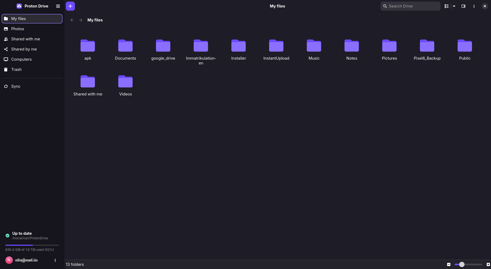
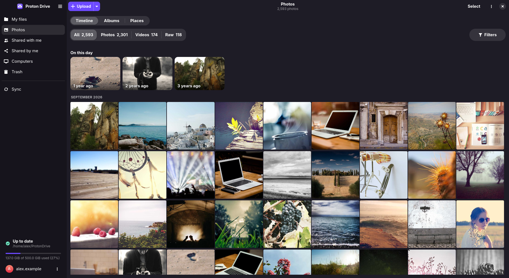
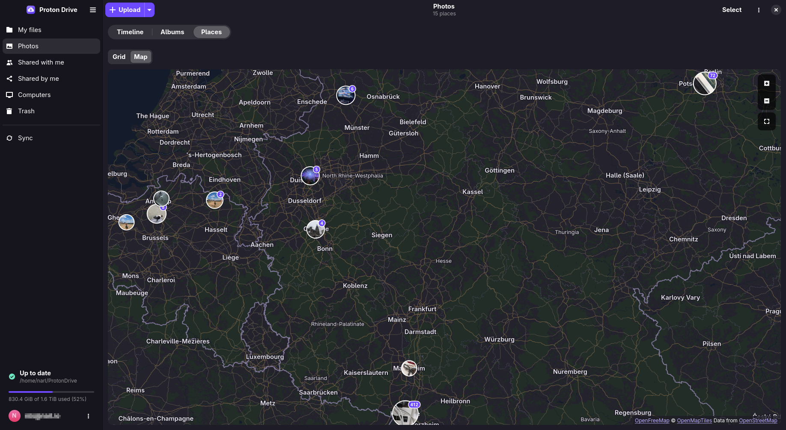
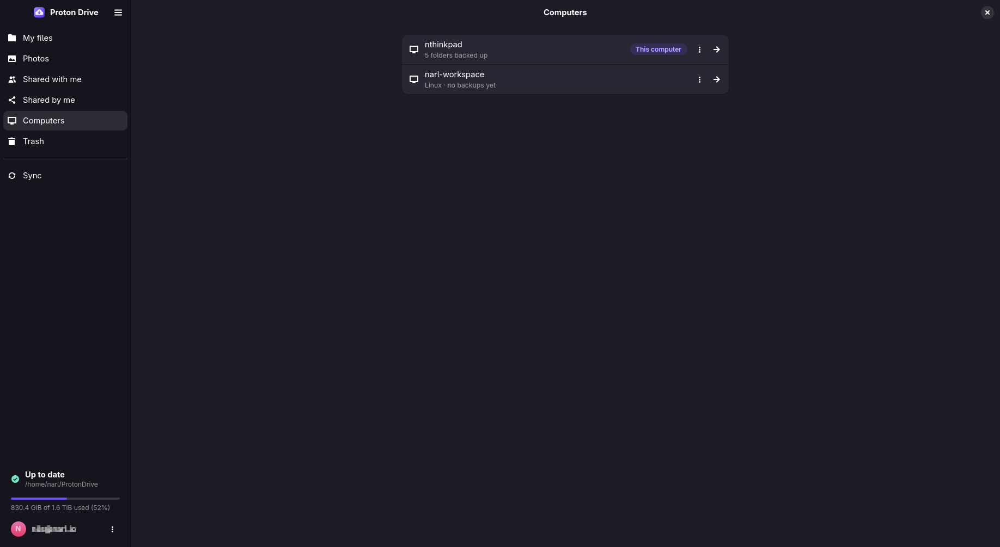
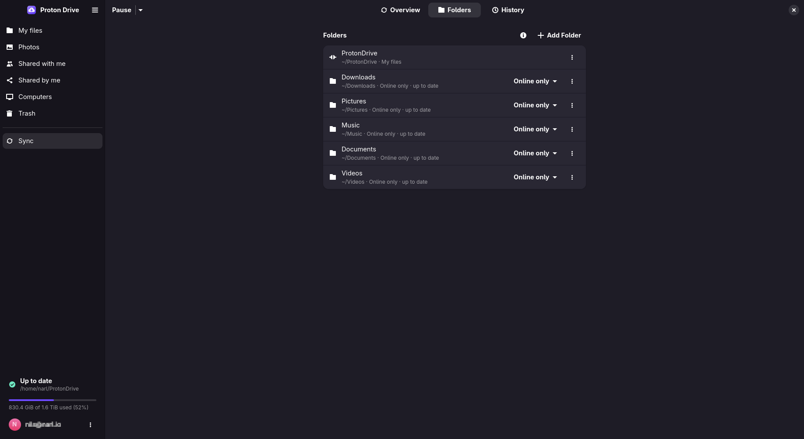
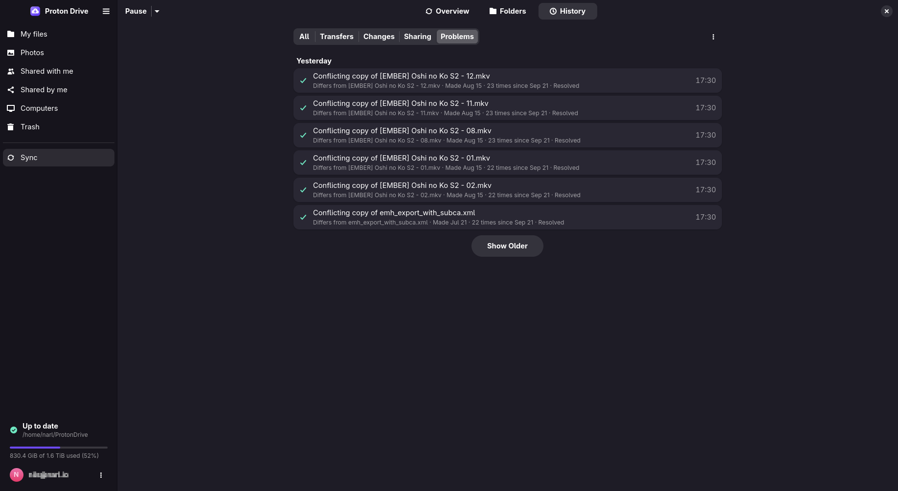
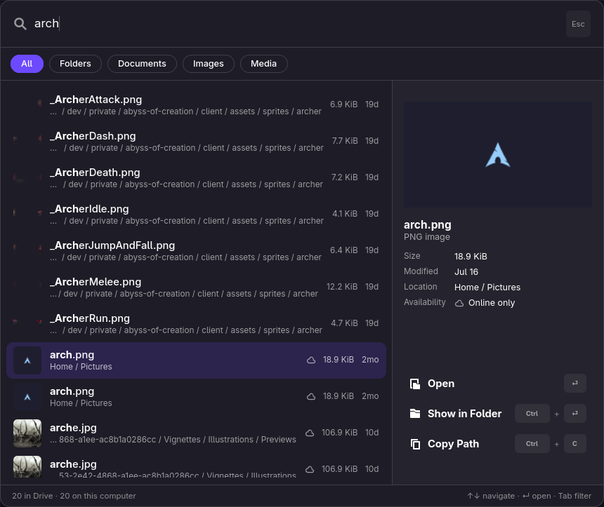
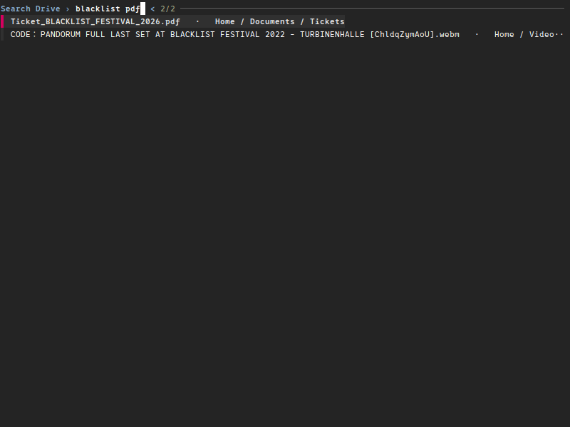
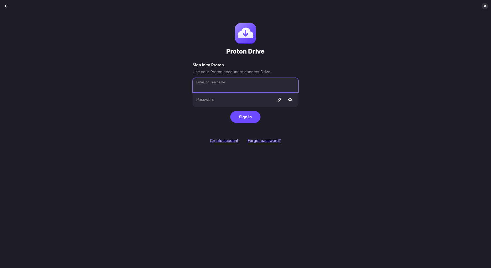

<div align="center">


# Proton Drive for Linux

**Proton Drive on the Linux desktop.** Your files as a folder that downloads on demand, synced
local folders, Photos, sharing, and a native GTK4 app with tray and search launcher, plus a
scriptable CLI.

**[proton-drive.narl.io](https://proton-drive.narl.io)**

[](https://github.com/narrrl/proton-drive-linux/actions/workflows/ci.yml)
[](https://github.com/narrrl/proton-drive-linux/releases/latest)
[](https://aur.archlinux.org/packages/proton-drive-for-linux)
[](LICENSE)
[](https://www.rust-lang.org)
[](https://buymeacoffee.com/narl)



</div>

> [!IMPORTANT]
> This is an **unofficial**, community-built client. It is not affiliated with, endorsed by, or
> supported by Proton AG. "Proton" and "Proton Drive" are trademarks of Proton AG, used here only
> to describe what the software talks to. Try it with data you have another copy of first, and
> read [what survives a lost machine](docs/RECOVERY.md) before you rely on it.

## Features

**Files**

- **Your Drive as a folder.** `~/ProtonDrive` works with every program. Files download when they
  are opened, a block at a time, so a video starts playing and a large archive can be read
  without fetching all of it.
- **Available offline.** Keep chosen files and folders fully downloaded; everything else is
  cached within a size limit you set.
- **Synced folders.** Back up folders such as `~/Documents` under your computer in Proton Drive,
  as a full two-way copy or online only. Gitignore-style `.pdfsignore` rules, conflict copies
  instead of overwrites, pause and bandwidth limits.
- **Works at local speed.** Making, renaming and deleting files and folders returns at once, online
  or offline. Changes are staged on disk and queued before they are acknowledged, so they survive
  a lost connection, a crash or a reboot and reach Drive when they can.

**Desktop app**

- **Browse** My files, Shared with me, Shared by me, Computers and Trash, with thumbnails
  (including camera RAW), drag and drop, details and **version history**.
- **Photos.** Timeline with favorites, albums, and Places on a map; RAW+JPEG pairs shown as one
  photo; duplicate finder; slideshow; **import from Google Photos** (Takeout).
- **Sharing.** Invite people as viewer, editor or admin, create public links with password and
  expiry, accept invitations.
- **Sync overview.** What is uploading, what is waiting, what failed and why, and a history of
  what happened. A change Drive refuses (storage full, access taken away) shows at once, on the
  file too, and can be exported or discarded.
- **Tray icon** with status, pause and quick actions, and a **search launcher** (`pdfs-prompt`)
  that searches Proton Drive and your home folder together, as its own window, through fuzzel,
  rofi or wofi, or live in `fzf`.
- **Restore a computer.** Continue a backup on a new machine and bring its folders back in one
  step.
- **Sign-in** with two-factor authentication and CAPTCHA; the session is kept in the system
  keyring.
- Available in English, German, Spanish, French, Italian, Dutch, Polish and Brazilian
  Portuguese.

**Command line**

- About 55 `pdfs` commands cover files, sync, sharing, Photos, Trash, versions and diagnostics.
  Query commands print JSON with `--json`.

## Install

| Distribution | Package |
|---|---|
| Debian, Ubuntu 24.04 or newer | `.deb` from the [latest release](https://github.com/narrrl/proton-drive-linux/releases/latest) |
| Fedora 44 or newer | `.rpm` from the [latest release](https://github.com/narrrl/proton-drive-linux/releases/latest) |
| Arch Linux | [`proton-drive-for-linux`](https://aur.archlinux.org/packages/proton-drive-for-linux) (also `-bin` and `-git`) in the AUR |
| Anything else | [Build from source](docs/INSTALL.md#build-from-source) |

```bash
sudo apt install ./proton-drive-linux_*.deb        # Debian, Ubuntu
sudo dnf install ./proton-drive-linux-*.rpm        # Fedora
paru -S proton-drive-for-linux                     # Arch
```

Then open **Proton Drive** from your applications menu and sign in. The app starts the background
service, and your files appear in `~/ProtonDrive`.

Signing in from a terminal instead? `pdfs login` stores the session but does not start the
service. Enable it once:

```bash
pdfs login
systemctl --user enable --now proton-drive.service
pdfs status
```

[docs/INSTALL.md](docs/INSTALL.md) has the requirements, optional extras (tray on GNOME, RAW and
video thumbnails), headless use and uninstalling.

## Documentation

| | |
|---|---|
| [User guide](docs/USER_GUIDE.md) | Everything the app, tray and launcher do |
| [Command-line reference](docs/CLI.md) | Every `pdfs` command and scripting with `--json` |
| [Configuration](docs/CONFIGURATION.md) | `config.json`, file locations, environment variables, the service |
| [Troubleshooting](docs/TROUBLESHOOTING.md) | Diagnosing problems and fixing common ones |
| [Recovering on a new computer](docs/RECOVERY.md) | Getting your synced folders back after a reinstall or a lost machine |
| [Changelog](docs/CHANGELOG.md) | What changed in each release |

For contributors: [development guide](docs/DEVELOPMENT.md), [architecture](docs/ARCHITECTURE.md),
[testing](docs/TESTING.md), [translating](docs/TRANSLATING.md), [roadmap](docs/ROADMAP.md) and the
[bug ledger](docs/BUGS.md). The [documentation index](docs/README.md) lists everything.

## Screenshots

<table>
  <tr>
    <td align="center" width="50%"><br><sub><b>My files</b></sub></td>
    <td align="center" width="50%"><br><sub><b>Photos</b></sub></td>
  </tr>
  <tr>
    <td align="center" width="50%"><br><sub><b>Places</b></sub></td>
    <td align="center" width="50%"><br><sub><b>Computers</b></sub></td>
  </tr>
  <tr>
    <td align="center" width="50%"><br><sub><b>Sync</b></sub></td>
    <td align="center" width="50%"><br><sub><b>Sync history</b></sub></td>
  </tr>
  <tr>
    <td align="center" width="50%"><br><sub><b>Search launcher</b></sub></td>
    <td align="center" width="50%"><br><sub><b>Search launcher in fzf</b></sub></td>
  </tr>
  <tr>
    <td align="center" width="50%"><br><sub><b>Sign in</b></sub></td>
    <td></td>
  </tr>
</table>

## How it works

A background service (`proton-drive.service`, the `pdfs daemon` command) holds your session,
mounts `~/ProtonDrive` through FUSE, runs the upload queue and the sync engine, and follows
Proton's event stream for changes made elsewhere. The app, the tray, the launcher and the CLI are
clients of that service over a local socket. Everything is end-to-end encrypted with your Proton
keys before it leaves the machine, through a Rust implementation of Proton's Drive SDK.

Files you open are decrypted into a local cache so programs can read them. What that means for
the security of the machine is spelled out in the
[threat model](docs/ARCHITECTURE.md#10-threat-model-what-this-client-writes-to-disk-in-plaintext).

## Contributing

Bug reports, translations and patches are welcome. See [CONTRIBUTING.md](CONTRIBUTING.md) for the
workflow and the checks CI runs, and [SECURITY.md](SECURITY.md) to report a vulnerability
privately.

## Support

Proton Drive Linux is free and built in spare time. If it saves you a few headaches, you can
[buy me a coffee](https://buymeacoffee.com/narl).

<a href="https://buymeacoffee.com/narl"></a>

## License

Released under the [MIT License](LICENSE).

The Places map uses [GeoNames](https://www.geonames.org/) data (CC BY 4.0) and
[Natural Earth](https://www.naturalearthdata.com/) outlines (public domain). The optional street
map comes from [OpenFreeMap](https://openfreemap.org/), © [OpenStreetMap](https://www.openstreetmap.org/copyright)
contributors.

Proton Drive is a service of Proton AG. This project is an independent client and carries no
affiliation with or endorsement from Proton AG.
