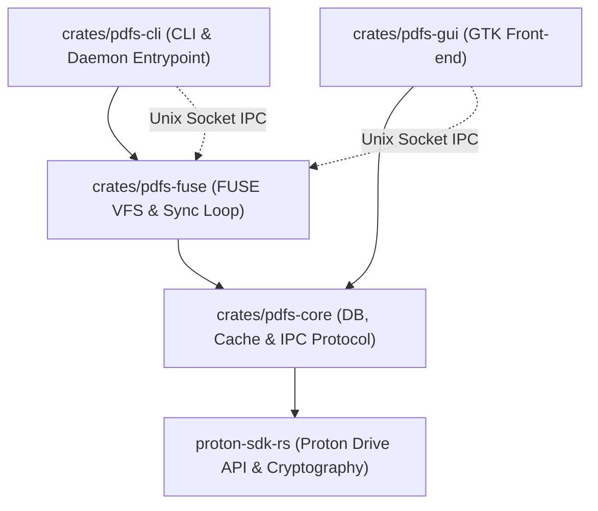
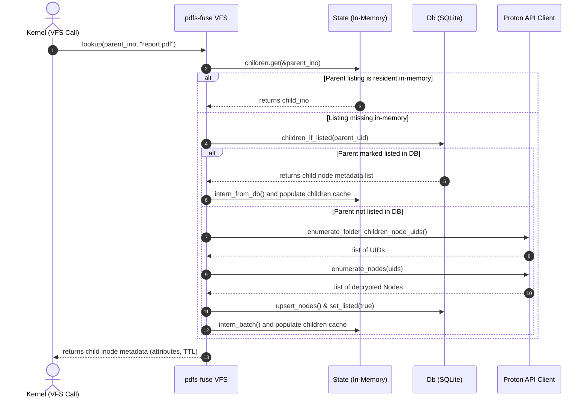
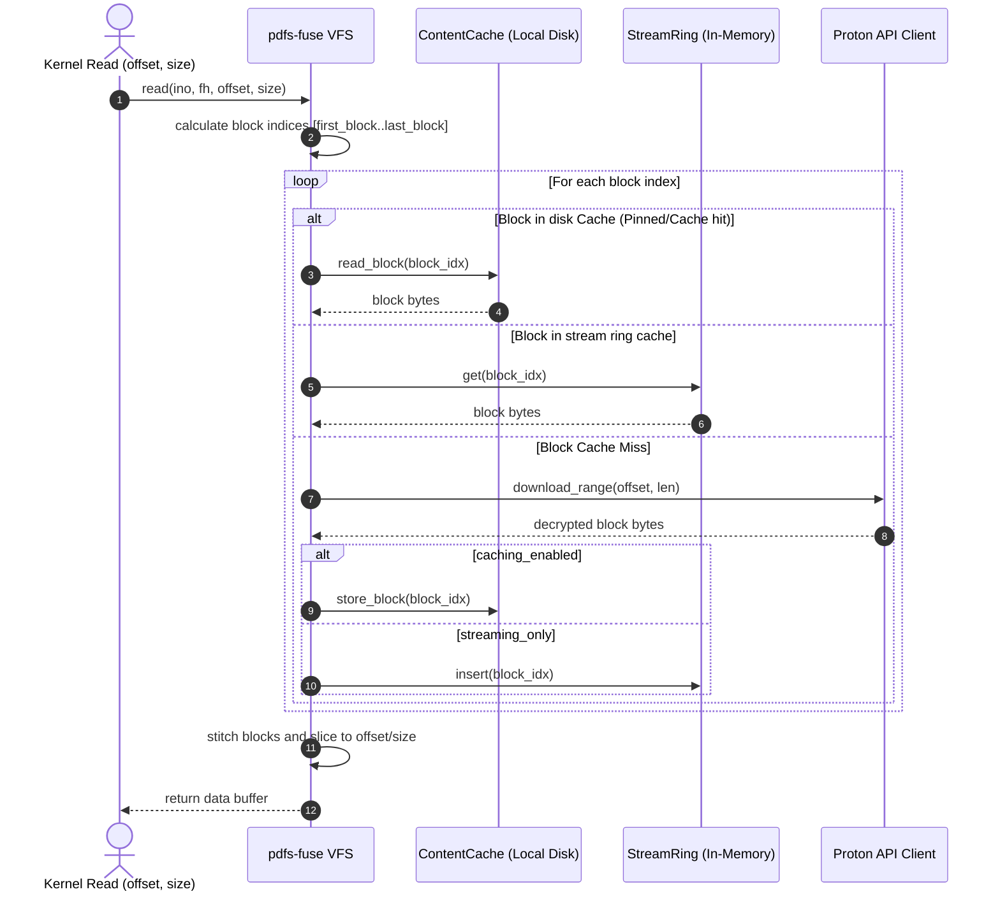
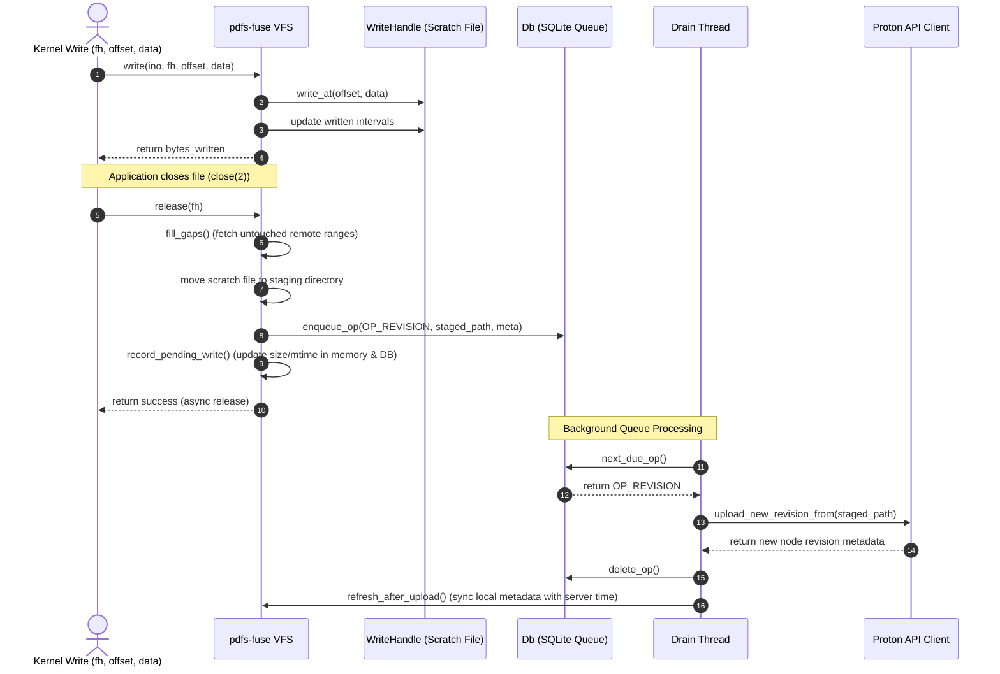
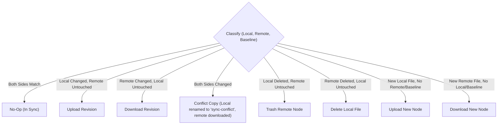
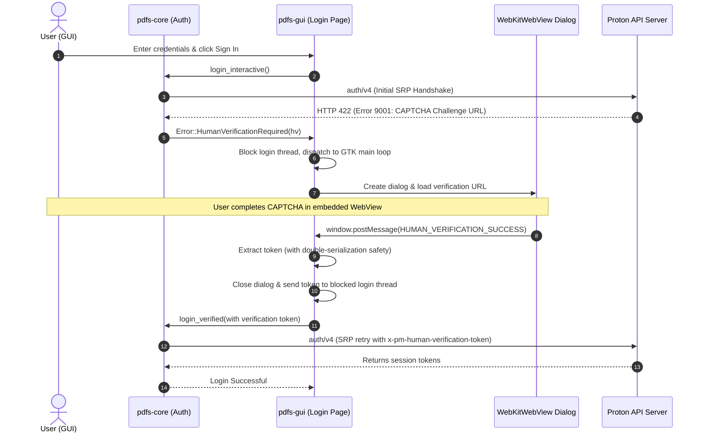

# Proton Drive Linux Client: Architecture Specification

This document provides a deep, comprehensive architectural description of the Proton Drive Linux Client (`pdfs`). It specifies the design patterns, data flows, thread models, and subsystem dependencies that govern the virtual filesystem (FUSE), database persistence, cache management, and two-way sync engine.

---

## 1. Subsystem Overview & Crate Topology

The application is modularized into four workspace crates, dividing core library logic, filesystem mounting, control-socket IPC, and front-ends.



### Crate Division & Responsibility Matrix

| Crate | Primary Role | Key Components | State Management |
|---|---|---|---|
| [`pdfs-core`](file:///home/narl/dev/private/proton-drive-linux/crates/pdfs-core) | Core Infrastructure & Services | Cache Bookkeeping, Database migrations/schemas, IPC protocol payloads. | Holds the unified SQLite DB (`Db`) connection and the on-disk cache metadata (`ContentCache`). |
| [`pdfs-fuse`](file:///home/narl/dev/private/proton-drive-linux/crates/pdfs-fuse) | VFS Layer & Reconciliation | FUSE callbacks, background upload queue (`drain`), two-way sync runner. | Manages in-memory inode maps (`State`), active descriptors (`WriteHandle`), and background task threads. |
| [`pdfs-cli`](file:///home/narl/dev/private/proton-drive-linux/crates/pdfs-cli) | Command Line Interface | Command routing, daemon launcher, IPC client wrapper. | Stateless; communicates with daemon over IPC control socket. |
| [`pdfs-gui`](file:///home/narl/dev/private/proton-drive-linux/crates/pdfs-gui) | Graphical Interface | GTK Page timelines (My files, Shared, Shared with me, Computers, Photos, Activity, Trash, Settings). | Stateless; polls daemon for status and lists timelines via IPC socket. |

---

## 2. In-Memory VFS State & File Operations

The VFS layer implements FUSE via the `fuser` crate. Because the remote storage contains base64-encoded file keys and requires cryptographic envelope parsing, raw listings and inodes are virtualized and stored in a local state directory.

### Inode and Path Resolution
* **In-Memory Cache (`State`):** Maps FUSE `u64` inodes to Proton Drive `NodeUid`s.
* **Database Row Mapping (`StoredNode`):** Stores directories, sizes, and timestamps.
* **On-Demand Loading (`ensure_children`):** If a directory is accessed, the daemon checks its database `listed` flag. If `listed = 0`, it triggers an API call to fetch remote nodes, populates the DB and in-memory caches, and returns.



---

## 3. Read Path & Block Caching Pipeline

Read requests are parallelized and served in blocks of size `BLOCK_SIZE` (4 MiB).

* **Unpinned files (Streaming):** Avoids writing full files to disk to preserve storage. Instead, blocks are kept in a fixed-size `stream_ring` (in-memory ring cache) and evicted immediately.
* **Pinned files (Persistent):** Block downloads are saved directly to `ContentCache` on disk.
* **Read-Ahead:** The reader thread spawns asynchronous tasks to pre-fetch upcoming blocks.



---

## 4. Write Path & Staging/Draining Pipeline

Because Proton Drive does not support partial byte writes, modified files must be uploaded as whole new revisions.

1. **Staging writes (`WriteHandle`):** Writes are stored locally in a `scratch` file. The daemon tracks modified regions using `Intervals` (which holds ranges of edited bytes).
2. **Close/Release (`queue_revision`):** When the application closes the file descriptor, the daemon:
   - Fetches any untouched gaps from the remote base file to compile the full file.
   - Moves the scratch file to `staging` under a `{uid}-{millis}-{counter}` name, so a staged blob can be tied back to its node without consulting the database.
   - Queues a pending database operation (`PendingOp`).
3. **Async Drain Thread (`run_pending_drain`):** The background drain worker picks up the database operations queue, handles revisions uploads, resolves conflicts, and cleans up staging files.



---

## 5. Sync Engine (Two-Way Reconciliation)

The sync engine handles offline-capable, bidirectional synchronization between the local disk and Proton Drive for directories marked in `mirror` mode.

### Lifecycle of a Sync Pass
1. **Walk Local:** Walks the local directory tree recursively, scanning sizes and modification times.
2. **Walk Remote:** Walks the remote database representation. If remote file modification times are updated, it calls the API to decrypt their sizes.
3. **Load Baseline:** Loads the `sync_entry` database table, which contains the snapshot of both sides during the *last successful sync*.
4. **Permutation Diffing:** The loop compares the three states (`local`, `remote`, `baseline`) to classify items:



5. **Depth-Ascending Batching:** Folders are processed first to ensure hierarchies exist before files are placed. Work is executed concurrently up to a set limit.
6. **Post-Sync Settle:** On success, baseline entries are upserted, timestamps updated, and any pending mode switches (e.g. going on-demand) are evaluated.

---

## 6. IPC Socket Protocol

The CLI and GUI front-ends do not access database files or make network calls directly. They communicate with the background daemon process over a Unix domain socket.

* **Transport:** IPC over Unix Stream Socket.
* **Framing:** Line-delimited JSON payloads.
* **Control Protocol:**
  * Client sends a single JSON line (`Request`).
  * Daemon parses, handles the request, and replies with a single JSON line (`Response`).
  * Timeout durations are separated: **2 seconds** for writes (avoids hangs on defunct sockets) and **120 seconds** for reads (accommodates heavy transfers).

---

## 7. Subsystem Interaction & Thread Map

The background daemon relies on the following thread topology:

1. **Main Thread / Dispatch Loop:** Blocks on `fuser::Session` loop. Reads kernel FUSE events and hands off network-bound VFS work to the FUSE workers pool.
2. **FUSE Workers Pool (11 threads, two lanes):** Bounded thread pool handling network operations. Split into 3 threads reserved for metadata (`lookup`, `readdir`) and 8 general threads that serve transfers (block reads) and fall back to metadata when no transfer is waiting. Reserved threads never accept a transfer — that is what keeps a directory listing from queuing behind saturated downloads (audit A6).
3. **IPC listener Thread:** Listens on Unix socket connections, spawning a lightweight task per connection to serve front-end status/configuration requests.
4. **Sync Engine Loop Thread:** Serializes sync runs. Wakes on debounced local inotify filesystem changes, remote polling intervals, or manual user requests.
5. **Drain Queue Worker Thread:** Processes staged writes (`PendingOp`) sequentially, uploading revisions and retrying with exponential backoff on failures.

---

## 8. Threat Model: What This Client Writes to Disk in Plaintext

Proton Drive is zero-knowledge: the server never holds the keys to your content. That property ends at this daemon. Serving a remote file through a POSIX filesystem means producing plaintext, and serving it *quickly* means keeping some of that plaintext around. This section states exactly what lands on disk, because the guarantee users infer from "zero-knowledge" is stronger than the one a files-on-demand client can offer locally.

**The short version: the cache and state directories hold decrypted content and decrypted metadata, and this client assumes the disk underneath them is encrypted (LUKS, or an encrypted home).** On an unencrypted disk, an attacker with the powered-off machine can read cached file content and the full name/structure of your Drive without ever touching your password.

### 8.1 Decrypted content

Everything under `$XDG_CACHE_HOME/<app>/content/` is plaintext:

| Path | Holds | Lifetime |
|---|---|---|
| `<uid>` blobs | Whole decrypted files (pinned files, opened files) | Until LRU eviction or budget purge |
| `blocks/` | Decrypted 4 MiB block ranges of partially-read files | Until LRU eviction |
| `thumbs/` | Decrypted thumbnails and previews | Until LRU eviction |
| `scratch/` | In-progress writes from open file handles | Until `release`, or rescued at next open |
| `staging/` | Released writes awaiting upload | **Until the upload lands** |
| `recovery/` | `fsync`ed writes rescued from an unclean shutdown | **Until replayed into `staging/`** |

`staging/` and `recovery/` deserve separate attention: unlike the cache directories, they are not a copy of something the server already has. They hold user-authored content that may exist **nowhere else yet**, which is why they are deliberately never cleared on startup (§4, and audit A2). They are simultaneously the most sensitive thing on disk and the thing that must not be deleted to reclaim space.

### 8.2 Decrypted metadata

`$XDG_STATE_HOME/<app>/cache.db` is a plain SQLite database containing **decrypted node names**, the folder hierarchy, sizes, timestamps, a trigram full-text index over those names, the activity log, and the photos timeline. It is not evictable and not budgeted — it is the persistence layer the in-memory tree rehydrates from (§2).

Filename and directory-structure confidentiality is an explicit part of Proton Drive's model (each folder's manifest is encrypted server-side). This database is where that property is spent locally: it is a queryable, plaintext index of your entire Drive, and it survives cache purges. A `PurgeCache` clears content, not this.

### 8.3 What is *not* written in plaintext

Credentials. The session blob — access and refresh tokens, and the key material needed to resume unattended — lives only in the OS keyring via libsecret (`auth.rs`), never on disk in cleartext. `config.json` and `pins.json` hold settings and node uids, no secrets.

Note that the *control socket* is a credential of a different kind: anything that can connect to `control.sock` can drive the daemon — list and read paths, upload, trash, create share links — without touching the keyring at all. See §8.5.

### 8.4 Memory, swap, and the page cache

Two exposures this client does **not** currently mitigate, stated plainly rather than left implied:

- **Swap.** Content keys, session keys, and decrypted buffers live in ordinary heap memory. Nothing calls `mlock(2)`, so under memory pressure they may be paged out. Raising `LimitMEMLOCK` in the systemd unit would *not* change this — there is no locking to permit. The effective mitigation is encrypted swap (dm-crypt / `systemd-cryptsetup`), which is standard on a LUKS install.
- **Kernel page cache.** Plaintext returned through FUSE is cached by the kernel like any other file data, and is likewise swappable. Defeating this would mean `direct_io` on every read, forfeiting the readahead and caching that make the mount usable. The trade is taken deliberately in favour of performance.

### 8.5 File modes: currently inherited, not enforced

**The daemon does not set restrictive permissions on anything it creates.** Cache and state directories come from `create_dir_all`, and `control.sock` from a plain `UnixListener::bind` — all subject to the process umask, which on a typical desktop yields `0755` directories and a `0755` socket.

What protects them today is the mode of the XDG parents (`~/.cache`, `~/.local/state`), which are conventionally `0700` — but that is a property of the user's system, not something this client establishes or verifies. On a machine where the home directory is group- or world-traversable, the consequences differ by artifact:

| Artifact | Exposure if the parent is traversable |
|---|---|
| `content/` | Another local user can read cached plaintext file content |
| `cache.db` | Another local user can read the full decrypted name/structure index |
| `control.sock` | **Another local user can drive the daemon**: enumerate, read, upload, trash, create public share links |

The socket is the sharpest of the three, because it is an authority boundary rather than a data one — connecting to it confers the daemon's authenticated session without any credential.

**Fixed (bugs.md B6):** `AppDirs::ensure` now sets `0700` on the state, cache, and config directories on every start — not only at creation, so a directory that already exists with a permissive mode is tightened — and `config::restrict_socket` sets `0600` on both sockets immediately after `bind`. The directories are restricted *before* the socket is bound, which closes the window between `bind` and `chmod`. A control socket whose mode cannot be set takes the daemon down rather than serving unguarded.

See [RECOVERY.md](RECOVERY.md) for what a lost machine means for the plaintext described in this section, and what to revoke.

### 8.6 Implications for deployment

- Treat the cache and state directories as being as sensitive as the Drive contents themselves.
- Multi-user machines warrant checking `~/.cache` and `~/.local/state` are `0700` until §8.5 is addressed.
- Purging the cache (`pdfs` settings, or `PurgeCache` over IPC) removes content but **not** `cache.db`, and deliberately never removes undrained `staging/` or `recovery/` blobs.

---

## 9. Human Verification (CAPTCHA) Flow

When logging in from an unfamiliar IP address or VPN, the Proton API may gate the sign-in with a human verification challenge (CAPTCHA). This client handles this asynchronously and interactively.

### 9.1 Sequence of Verification and Re-Authentication



### 9.2 Key Technical Design Decisions

1. **Weak Reference UI Binding:** To prevent memory leaks and strong reference cycles between the parent dialog, the child `WebKitWebView`, the script message manager, and the connection callback, the dialog is downgraded to a `WeakRef` inside the callback:
   ```rust
   let dlg_weak = dialog.downgrade();
   content.connect_script_message_received(Some("hv"), move |_, value| {
       // ...
       if let Some(dlg) = dlg_weak.upgrade() {
           dlg.close();
       }
   });
   ```
2. **Double-Serialization Tolerance:** The JavaScript message listener forwards event data as a JSON string to the native handler. Since the underlying page may post either JS objects or pre-serialized JSON strings, the Rust side performs dual-phase parsing:
   ```rust
   let mut value = serde_json::from_str(raw).ok()?;
   if let Some(inner) = value.as_str() {
       if let Ok(parsed) = serde_json::from_str(inner) {
           value = parsed;
       }
   }
   ```
   This ensures compatibility with all versions of Proton's client verification scripts.
3. **SRP Handshake Reset:** Because a gated login burns the SRP handshake on the API side, the client cannot simply resume the previous request. Instead, `auth::login_interactive` restarts the SRP process from scratch with the verification credentials attached, keeping the complex handshake details isolated from the front-end.
4. **CLI Fallback:** Since the CLI has no native web browser engine, hitting the CAPTCHA gate fails immediately with a user-friendly message directing the user to sign in once via the GUI (`pdfs-app`) to persist the authenticated session keys to the system keyring.

