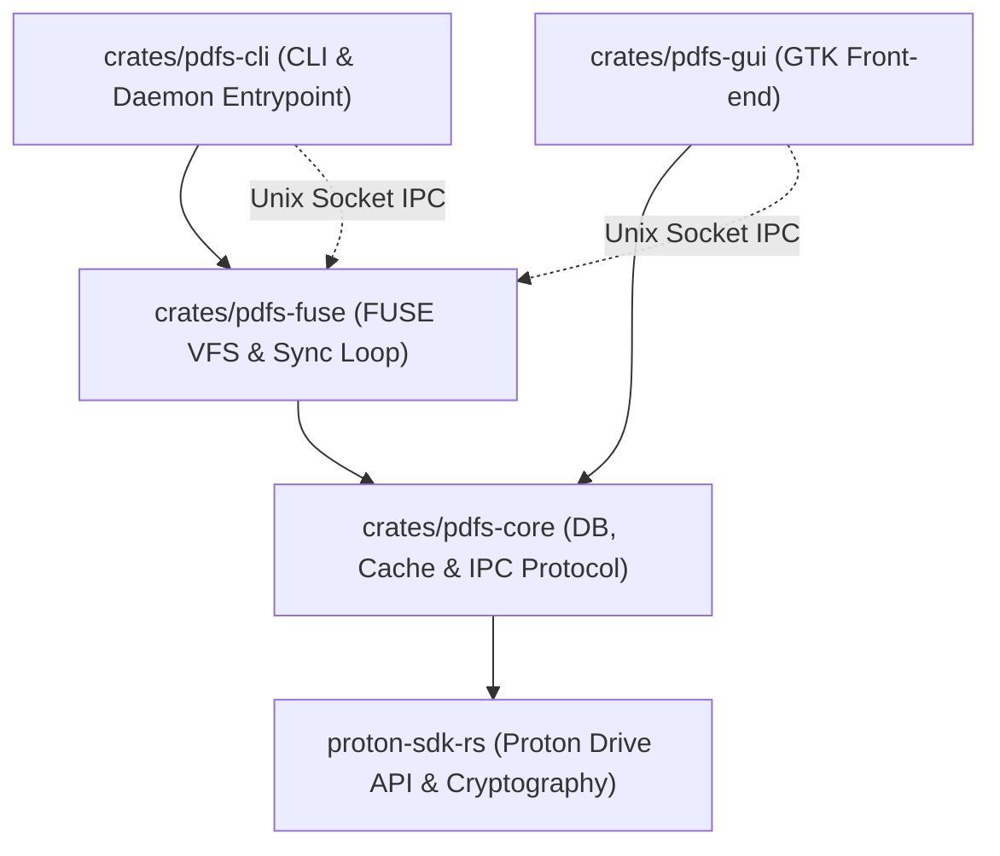
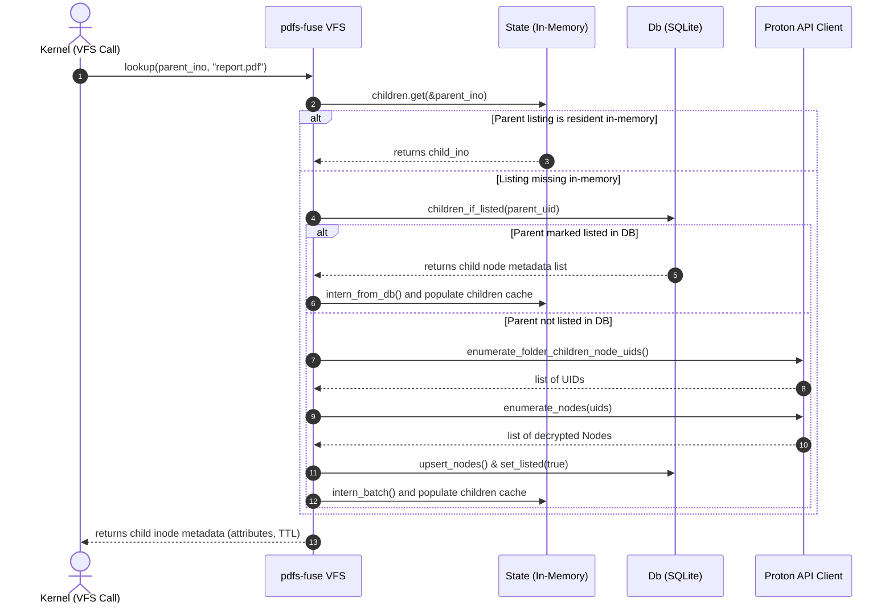
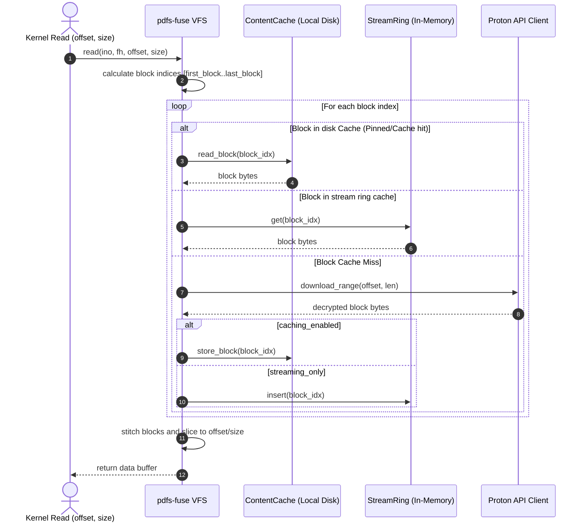
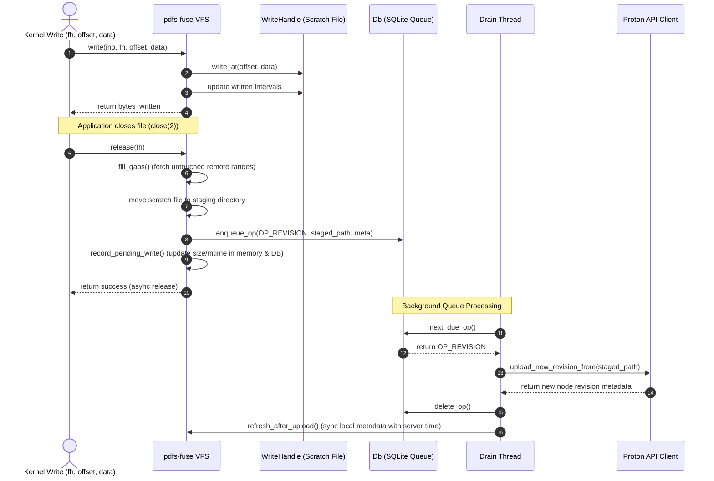
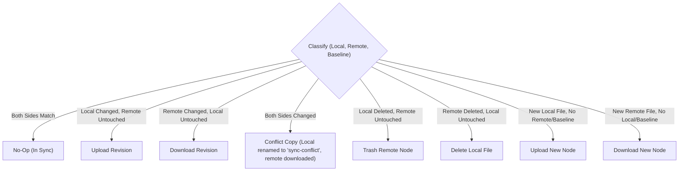

# Proton Drive Linux Client: Architecture Specification

This document provides a deep, comprehensive architectural description of the Proton Drive Linux Client (`pdfs`). It specifies the design patterns, data flows, thread models, and subsystem dependencies that govern the virtual filesystem (FUSE), database persistence, cache management, and two-way sync engine.

---

## 1. Subsystem Overview & Crate Topology

The application is modularized into four workspace crates, dividing core library logic, filesystem mounting, control-socket IPC, and front-ends.

### Crate Division & Responsibility Matrix

| Crate | Primary Role | Key Components | State Management |
|---|---|---|---|
| [`pdfs-core`](file:///home/narl/dev/private/proton-drive-linux/crates/pdfs-core) | Core Infrastructure & Services | Cache Bookkeeping, Database migrations/schemas, IPC protocol payloads. | Holds the unified SQLite DB (`Db`) connection and the on-disk cache metadata (`ContentCache`). |
| [`pdfs-fuse`](file:///home/narl/dev/private/proton-drive-linux/crates/pdfs-fuse) | VFS Layer & Reconciliation | FUSE callbacks, background upload queue (`drain`), two-way sync runner. | Manages in-memory inode maps (`State`), active descriptors (`WriteHandle`), and background task threads. |
| [`pdfs-cli`](file:///home/narl/dev/private/proton-drive-linux/crates/pdfs-cli) | Command Line Interface | Command routing, daemon launcher, IPC client wrapper. | Stateless; communicates with daemon over IPC control socket. |
| [`pdfs-gui`](file:///home/narl/dev/private/proton-drive-linux/crates/pdfs-gui) | Graphical Interface | GTK Page timelines (Files, Photos, Shares, Status). | Stateless; polls daemon for status and lists timelines via IPC socket. |

---

## 2. In-Memory VFS State & File Operations

The VFS layer implements FUSE via the `fuser` crate. Because the remote storage contains base64-encoded file keys and requires cryptographic envelope parsing, raw listings and inodes are virtualized and stored in a local state directory.

### Inode and Path Resolution
* **In-Memory Cache (`State`):** Maps FUSE `u64` inodes to Proton Drive `NodeUid`s.
* **Database Row Mapping (`StoredNode`):** Stores directories, sizes, and timestamps.
* **On-Demand Loading (`ensure_children`):** If a directory is accessed, the daemon checks its database `listed` flag. If `listed = 0`, it triggers an API call to fetch remote nodes, populates the DB and in-memory caches, and returns.

---

## 3. Read Path & Block Caching Pipeline

Read requests are parallelized and served in blocks of size `BLOCK_SIZE` (4 MiB).

* **Unpinned files (Streaming):** Avoids writing full files to disk to preserve storage. Instead, blocks are kept in a fixed-size `stream_ring` (in-memory ring cache) and evicted immediately.
* **Pinned files (Persistent):** Block downloads are saved directly to `ContentCache` on disk.
* **Read-Ahead:** The reader thread spawns asynchronous tasks to pre-fetch upcoming blocks.

---

## 4. Write Path & Staging/Draining Pipeline

Because Proton Drive does not support partial byte writes, modified files must be uploaded as whole new revisions.

1. **Staging writes (`WriteHandle`):** Writes are stored locally in a `scratch` file. The daemon tracks modified regions using `Intervals` (which holds ranges of edited bytes).
2. **Close/Release (`queue_revision`):** When the application closes the file descriptor, the daemon:
   - Fetches any untouched gaps from the remote base file to compile the full file.
   - Moves the scratch file to `staging` under a cryptographic checksum name.
   - Queues a pending database operation (`PendingOp`).
3. **Async Drain Thread (`run_pending_drain`):** The background drain worker picks up the database operations queue, handles revisions uploads, resolves conflicts, and cleans up staging files.

---

## 5. Sync Engine (Two-Way Reconciliation)

The sync engine handles offline-capable, bidirectional synchronization between the local disk and Proton Drive for directories marked in `mirror` mode.

### Lifecycle of a Sync Pass
1. **Walk Local:** Walks the local directory tree recursively, scanning sizes and modification times.
2. **Walk Remote:** Walks the remote database representation. If remote file modification times are updated, it calls the API to decrypt their sizes.
3. **Load Baseline:** Loads the `sync_entry` database table, which contains the snapshot of both sides during the *last successful sync*.
4. **Permutation Diffing:** The loop compares the three states (`local`, `remote`, `baseline`) to classify items:

5. **Depth-Ascending Batching:** Folders are processed first to ensure hierarchies exist before files are placed. Work is executed concurrently up to a set limit.
6. **Post-Sync Settle:** On success, baseline entries are upserted, timestamps updated, and any pending mode switches (e.g. going on-demand) are evaluated.

---

## 6. IPC Socket Protocol

The CLI and GUI front-ends do not access database files or make network calls directly. They communicate with the background daemon process over a Unix domain socket.

* **Transport:** IPC over Unix Stream Socket.
* **Framing:** Line-delimited JSON payloads.
* **Control Protocol:**
  * Client sends a single JSON line (`Request`).
  * Daemon parses, handles the request, and replies with a single JSON line (`Response`).
  * Timeout durations are separated: **2 seconds** for writes (avoids hangs on defunct sockets) and **120 seconds** for reads (accommodates heavy transfers).

---

## 7. Subsystem Interaction & Thread Map

The background daemon relies on the following thread topology:

1. **Main Thread / Dispatch Loop:** Blocks on `fuser::Session` loop. Reads kernel FUSE events and hands off network-bound VFS work to the FUSE workers pool.
2. **FUSE Workers Pool (8 threads):** Bounded thread pool handling network operations (block reads, gap filling, file creations) to avoid stalling metadata operations.
3. **IPC listener Thread:** Listens on Unix socket connections, spawning a lightweight task per connection to serve front-end status/configuration requests.
4. **Sync Engine Loop Thread:** Serializes sync runs. Wakes on debounced local inotify filesystem changes, remote polling intervals, or manual user requests.
5. **Drain Queue Worker Thread:** Processes staged writes (`PendingOp`) sequentially, uploading revisions and retrying with exponential backoff on failures.
