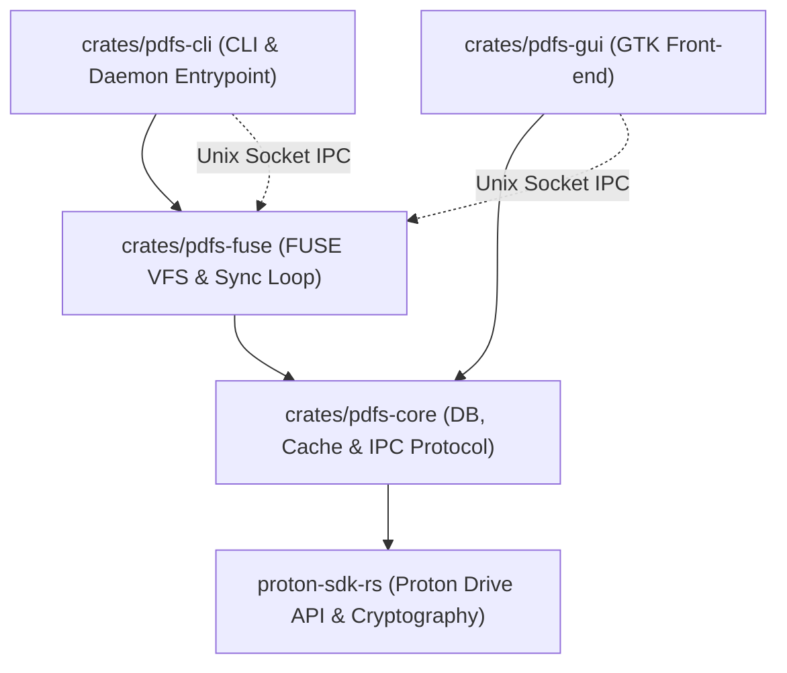
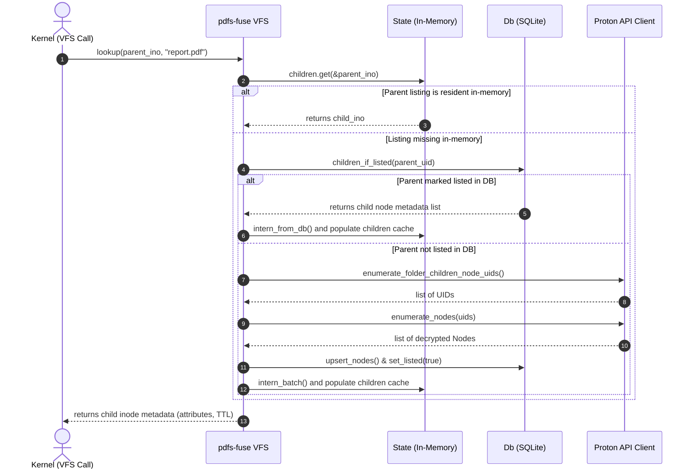
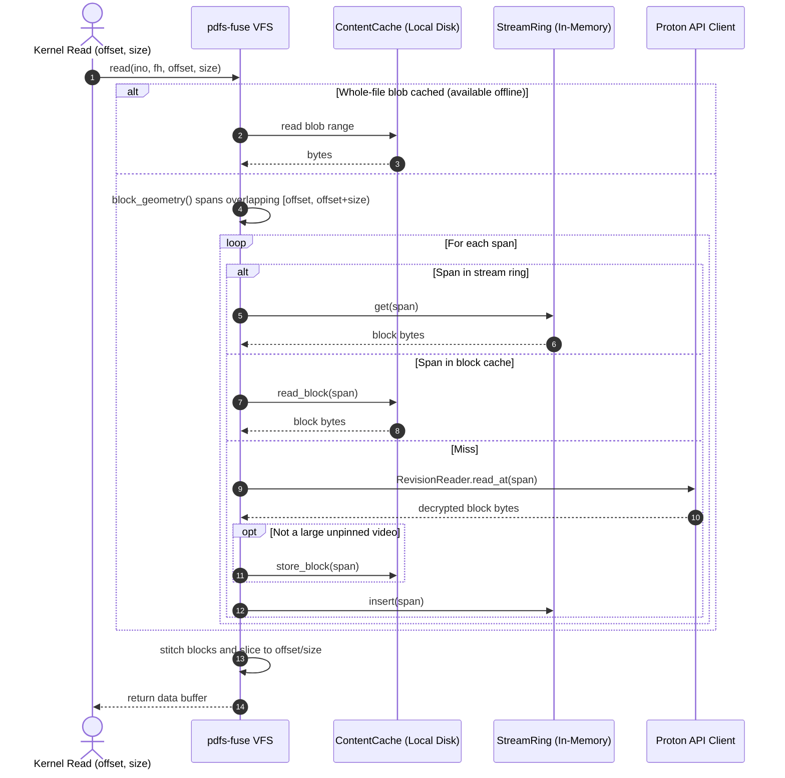
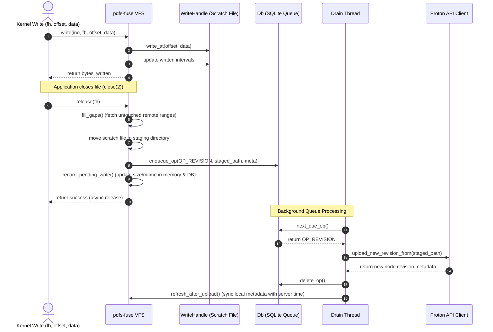
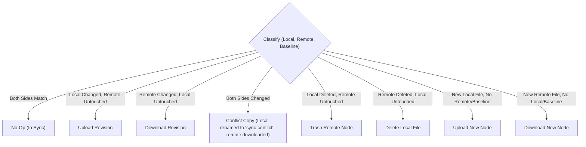
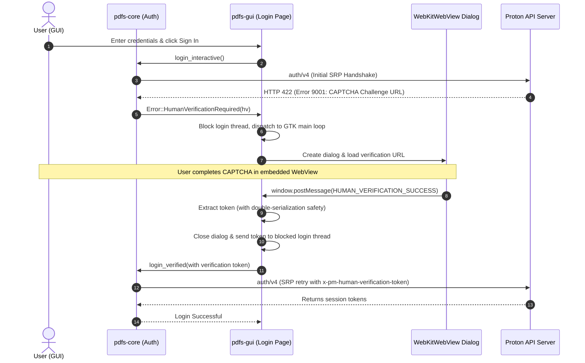

# Architecture

This document describes how the Proton Drive Linux client (`pdfs`) is built: the crates, the
filesystem and its caches, the write queue, the sync engine, the control protocol, the thread
layout, what the client writes to disk in plaintext, and the CAPTCHA flow. It is written for
contributors and for anyone auditing the client. User-facing documentation starts at
[docs/README.md](README.md).

Numbers quoted here (thread counts, timeouts, limits) are the constants in the source at the time
of writing; the source is authoritative when they disagree.

---

## 1. Subsystem Overview & Crate Topology

The application is modularized into four workspace crates, dividing core library logic, filesystem mounting, control-socket IPC, and front-ends.


```mermaid
graph TD
    %% Crates
    CLI["crates/pdfs-cli (CLI & Daemon Entrypoint)"]
    GUI["crates/pdfs-gui (GTK Front-end)"]
    FUSE["crates/pdfs-fuse (FUSE VFS & Sync Loop)"]
    CORE["crates/pdfs-core (DB, Cache & IPC Protocol)"]
    SDK["proton-sdk-rs (Proton Drive API & Cryptography)"]

    %% Dependencies
    CLI --> FUSE
    GUI --> CORE
    FUSE --> CORE
    CORE --> SDK
    CLI -.->|Unix Socket IPC| FUSE
    GUI -.->|Unix Socket IPC| FUSE
```

### Crate Division & Responsibility Matrix

| Crate | Primary Role | Key Components | State Management |
|---|---|---|---|
| [`pdfs-core`](../crates/pdfs-core) | Core Infrastructure & Services | Cache bookkeeping, database migrations/schemas, IPC protocol payloads, and shared search relevance scoring. | Holds the unified SQLite DB (`Db`) connection and the on-disk cache metadata (`ContentCache`). |
| [`pdfs-fuse`](../crates/pdfs-fuse) | VFS Layer & Reconciliation | FUSE callbacks, background upload queue (`drain`), two-way sync runner. | Manages in-memory inode maps (`State`), active descriptors (`WriteHandle`), and background task threads. |
| [`pdfs-cli`](../crates/pdfs-cli) | Command Line Interface | Command routing, daemon launcher, IPC client wrapper. | Stateless; communicates with daemon over IPC control socket. |
| [`pdfs-gui`](../crates/pdfs-gui) | Graphical Interface | GTK pages, tray, and the resident quick-search prompt. | Keeps UI state only; all durable state and Drive access remain behind the IPC socket. |

The workspace ships four binaries: `pdfs` (the CLI, and the daemon as `pdfs daemon`) from
`pdfs-cli`, and `pdfs-app`, `pdfs-tray` and `pdfs-prompt` from `pdfs-gui`. The daemon runs as the
systemd user unit `proton-drive.service`. Only the daemon holds the database, the caches and the
API client; every other binary is a client of its control socket.

---

## 2. In-Memory VFS State & File Operations

The VFS layer implements FUSE via the `fuser` crate. Because the remote storage contains base64-encoded file keys and requires cryptographic envelope parsing, raw listings and inodes are virtualized and stored in a local state directory.

### Inode and Path Resolution
* **In-Memory Cache (`State`):** Maps FUSE `u64` inodes to Proton Drive `NodeUid`s.
* **Database Row Mapping (`StoredNode`):** Stores directories, sizes, and timestamps.
* **On-Demand Loading (`ensure_children`):** If a directory is accessed, the daemon checks its database `listed` flag. If `listed = 0`, it triggers an API call to fetch remote nodes, populates the DB and in-memory caches, and returns.


```mermaid
sequenceDiagram
    autonumber
    actor User as Kernel (VFS Call)
    participant FUSE as pdfs-fuse VFS
    participant ST as State (In-Memory)
    participant DB as Db (SQLite)
    participant API as Proton API Client

    User->>FUSE: lookup(parent_ino, "report.pdf")
    FUSE->>ST: children.get(&parent_ino)
    alt Parent listing is resident in-memory
        ST-->>FUSE: returns child_ino
    else Listing missing in-memory
        FUSE->>DB: children_if_listed(parent_uid)
        alt Parent marked listed in DB
            DB-->>FUSE: returns child node metadata list
            FUSE->>ST: intern_from_db() and populate children cache
        else Parent not listed in DB
            FUSE->>API: enumerate_folder_children_node_uids()
            API-->>FUSE: list of UIDs
            FUSE->>API: enumerate_nodes(uids)
            API-->>FUSE: list of decrypted Nodes
            FUSE->>DB: upsert_nodes() & set_listed(true)
            FUSE->>ST: intern_batch() and populate children cache
        end
    end
    FUSE-->>User: returns child inode metadata (attributes, TTL)
```

### Access Classification and Enforcement

Every `Entry` carries an `Access` (`Owner | Editor | Viewer | Unknown`), inherited from its parent at intern time rather than resolved per node — a child is always interned from its parent's listing, so one edge lookup answers it. A known share root takes its access from the persisted `share_access` table instead, which is also what makes the classification correct offline.

Two rules decide the cases inheritance cannot:

* **Not under a share, no role → `Owner` (fail open).** My Files and device folders are owned content; regressing this denies ordinary writes.
* **Under a share with no usable role → `Viewer` (fail closed).** An unrecognised permission mask is never degraded into a guess.

A node whose parent is not resident is the awkward case: a device folder's parent is the device root, which is never persisted as a node, so the whole subtree hydrates parentless. It resolves the way the persisted authority (`Db::effective_node_access`) does — a recorded share row above it wins, otherwise fail open on the mount's own volume and closed on a foreign one (`docs/BUGS.md` B79).

Enforcement is three layers, and only the third closes B34:

1. **Mode bits.** `attr()` returns `0o555`/`0o444` for a non-writable entry, and both mount paths set `MountOption::DefaultPermissions`, so the *kernel* refuses `open(O_WRONLY)`, `access(W_OK)` and namespace operations for any non-root process.
2. **Handler gates.** `EACCES` in `create`/`mkdir`/`unlink`/`rmdir`/`rename` (parent-writable; both parents for a rename) and in `open`-for-write/`write`/`setattr`/`fallocate`. Covers root and stale attribute TTLs.
3. **Queue guards.** `Core::require_uid_writable` admits a mutation only when the persisted authority *and* every live inode space agree the uid is writable. Nothing reaches `pending_op` otherwise, so the perpetual failing drain that B34 describes cannot occur even if a handler check is missed. The intersection is across mounts because a uid may be resident in more than one inode space.

`EACCES`, not `EROFS`, for a read-only subtree inside a read-write mount: `EROFS` means "read-only filesystem" and misleads the heuristics in `cp`, `rsync` and `git`.

### Local Locations

`mount` is a presentation table: one row per local place this client occupies — the primary My Files session, and each device folder in mirror or on-demand mode. `sync_folder` remains the sync engine's own table (`sync_entry` is FK'd to it) and `MountKind::Device { sync_folder_id }` is the join. `Request::ListLocations` serves the table to `pdfs locations` and the GUI's Locations page.

A mirror folder is a plain local directory with no FUSE session, so a row can legitimately describe a location that is not mounted — which is why the page is called *Locations* rather than *Mounts*. The primary mountpoint stays in `AppConfig`, with its `mount` row written at daemon start as a projection of it, so there are not two sources of truth for that path.

---

## 3. Read Path & Block Caching Pipeline

Reads are served from the revision's content blocks. `Core::read_range` looks in three places
before the network:

1. **Whole-file blob.** A file kept available offline is downloaded completely into
   `ContentCache` and read from there.
2. **Stream ring.** For every other file, a bounded in-memory ring (`RING_BYTES`, 128 MiB) of
   recently decrypted blocks is checked first, because the kernel reads in pieces far smaller
   than a block.
3. **Block cache.** Blocks are then looked up on disk, under `content/blocks/`. They count
   against `cache_budget` and are evicted least-recently-used.

On a miss, only the blocks that overlap the request are fetched, through a `RevisionReader` kept
open per revision (`MAX_OPEN_READERS = 64`, validated by `(mtime, size)`).

* **Block geometry.** Block boundaries come from the revision itself. The first read of a file
  assumes uniform `BLOCK_SIZE` (4 MiB) blocks; once a reader is open, the real block sizes are
  recorded (`store_block_geometry`) and later reads plan on them. Proton does not guarantee
  4 MiB blocks, and assuming it served wrong bytes (`docs/BUGS.md` B85).
* **Read-ahead.** A read that proves sequential prefetches a window of 2 to 8 blocks
  (`PREFETCH_MIN`, `PREFETCH_MAX`). Prefetch takes a permit from a global budget of 8 and gives up
  instead of queueing, so it never delays a demand read.
* **Large videos.** An unpinned video of 256 MiB or more (`STREAM_BYPASS_MIN`) streams without
  persisting its blocks, so watching a film does not evict the rest of the cache.


```mermaid
sequenceDiagram
    autonumber
    actor Kernel as Kernel Read (offset, size)
    participant FUSE as pdfs-fuse VFS
    participant Cache as ContentCache (Local Disk)
    participant Ring as StreamRing (In-Memory)
    participant API as Proton API Client

    Kernel->>FUSE: read(ino, fh, offset, size)
    alt Whole-file blob cached (available offline)
        FUSE->>Cache: read blob range
        Cache-->>FUSE: bytes
    else
        FUSE->>FUSE: block_geometry() spans overlapping [offset, offset+size)
        loop For each span
            alt Span in stream ring
                FUSE->>Ring: get(span)
                Ring-->>FUSE: block bytes
            else Span in block cache
                FUSE->>Cache: read_block(span)
                Cache-->>FUSE: block bytes
            else Miss
                FUSE->>API: RevisionReader.read_at(span)
                API-->>FUSE: decrypted block bytes
                opt Not a large unpinned video
                    FUSE->>Cache: store_block(span)
                end
                FUSE->>Ring: insert(span)
            end
        end
    end
    FUSE->>FUSE: stitch blocks and slice to offset/size
    FUSE-->>Kernel: return data buffer
```

---

## 4. Write Path & Staging/Draining Pipeline

Because Proton Drive does not support partial byte writes, modified files must be uploaded as whole new revisions.

1. **Staging writes (`WriteHandle`):** Writes are stored locally in a `scratch` file. The daemon tracks modified regions using `Intervals` (which holds ranges of edited bytes).
2. **Close/Release (`queue_revision`):** When the application closes the file descriptor, the daemon:
   - Fetches any untouched gaps from the remote base file to compile the full file.
   - Durably publishes the scratch data and authored-range sidecar into `staging` under a `{uid}-{millis}-{counter}` name. Temporary data and metadata are synced before atomic rename, and their directory is synced before the source is removed.
   - Transactionally queues or supersedes a pending database operation (`PendingOp`), so insertion failure cannot erase the previously acknowledged upload. For `OP_REVISION` ops, execution is debounced to give rapid follow-up writes (e.g. `aria2c` preallocation followed by writing) time to supersede the staged blob before network transmission. The debounce is adaptive (`Core::revision_debounce`): it starts at `DRAIN_REVISION_DEBOUNCE = 2s` and, once a node has been uploaded, widens toward how long that upload actually took, bounded by `DRAIN_REVISION_DEBOUNCE_MAX = 60s`. A file saved faster than it can be sent therefore supersedes in the queue rather than mid-upload.
   - Signals `Core::cancel_upload` for the node before touching the queue. A drain worker may already be reading the blob this write supersedes; the flag is read by the upload's `CountingReader`, which refuses the SDK's next block. `queue_trash` and `discard_queued_ops` do the same, because they unlink the blob outright.
3. **Async Drain Threads (`run_pending_drain`):** `DRAIN_WORKERS = 3` background workers share the operations queue. They pick work up through `Db::claim_next_due_op`, which marks the row `claimed_at` in the same transaction that selects it and excludes any op whose uid another worker already holds — ordering only has to hold *per node*, and that exclusion is what guarantees it. Worker 0 additionally runs the queue's idle chores (LRU touch flush, `recover_fsynced_writes`). A claim is process-local state: the single-writer `flock` means one found at open belongs to a crashed run, and `Db::clear_op_claims` drops the lot so those ops are not invisible forever. Each worker handles revision uploads, resolves conflicts, and cleans up staging files. Upon landing a revision upload (`refresh_after_upload`), it rebaselines both still-queued ops (`rebaseline_pending`) and open write handles targeting the same node to prevent false self-conflict copies on subsequent writes.


```mermaid
sequenceDiagram
    autonumber
    actor Kernel as Kernel Write (fh, offset, data)
    participant FUSE as pdfs-fuse VFS
    participant WH as WriteHandle (Scratch File)
    participant DB as Db (SQLite Queue)
    participant DR as Drain Thread
    participant API as Proton API Client

    Kernel->>FUSE: write(ino, fh, offset, data)
    FUSE->>WH: write_at(offset, data)
    FUSE->>WH: update written intervals
    FUSE-->>Kernel: return bytes_written

    Note over Kernel, FUSE: Application closes file (close(2))
    Kernel->>FUSE: release(fh)
    FUSE->>FUSE: fill_gaps() (fetch untouched remote ranges)
    FUSE->>FUSE: move scratch file to staging directory
    FUSE->>DB: enqueue_op(OP_REVISION, staged_path, meta)
    FUSE->>FUSE: record_pending_write() (update size/mtime in memory & DB)
    FUSE-->>Kernel: return success (async release)
    
    Note over DB, DR: Background Queue Processing
    DR->>DB: next_due_op()
    DB-->>DR: return OP_REVISION
    DR->>API: upload_new_revision_from(staged_path)
    API-->>DR: return new node revision metadata
    DR->>DB: delete_op()
    DR->>FUSE: refresh_after_upload() (sync local metadata with server time)
```

---

## 5. Sync Engine (Two-Way Reconciliation)

The sync engine handles offline-capable, bidirectional synchronization between the local disk and Proton Drive for directories marked in `mirror` mode.

### Lifecycle of a Sync Pass
1. **Walk Local:** Walks the local directory tree recursively, scanning sizes and modification times while carrying a completeness result. A `readdir`, metadata, permission, or transient I/O failure makes the pass non-destructive instead of turning omitted paths into deletions.
2. **Walk Remote:** Walks the remote database representation. If remote file modification times are updated, it calls the API to decrypt their sizes.
3. **Load Baseline:** Loads the `sync_entry` database table, which contains the snapshot of both sides during the *last successful sync*.
4. **Permutation Diffing:** The loop compares the three states (`local`, `remote`, `baseline`) to classify items:


```mermaid
graph TD
    %% States
    Classify{"Classify (Local, Remote, Baseline)"}

    %% Logic Rules
    Classify -->|Both Sides Match| Match["No-Op (In Sync)"]
    Classify -->|Local Changed, Remote Untouched| Upload["Upload Revision"]
    Classify -->|Remote Changed, Local Untouched| Download["Download Revision"]
    Classify -->|Both Sides Changed| Conflict["Conflict Copy (Local renamed to 'sync-conflict', remote downloaded)"]
    Classify -->|Local Deleted, Remote Untouched| RemoteDelete["Trash Remote Node"]
    Classify -->|Remote Deleted, Local Untouched| LocalDelete["Delete Local File"]
    Classify -->|New Local File, No Remote/Baseline| UploadNew["Upload New Node"]
    Classify -->|New Remote File, No Local/Baseline| DownloadNew["Download New Node"]
```

5. **Depth-Ascending Batching:** Folders are processed first to ensure hierarchies exist before files are placed. Work is executed concurrently up to a set limit.
6. **Safety Gate and Settle:** Destructive plans are rejected when the scan is incomplete. Total-wipe protection applies to every non-empty baseline, including a single-entry folder. On success, baseline entries are upserted, timestamps updated, and any pending mode switches (e.g. going on-demand) are evaluated. Failed local deletion or conflict preservation retains the previous baseline and prevents remote content from overwriting the local source.

### Conflict Copies

A conflict keeps both versions. The local file is renamed to
`{stem} (sync-conflict {unix_secs}).{ext}` (with `-1`, `-2`, … appended to the timestamp when the
name is taken) and the remote version is downloaded under the original name. The conflict sweep
(§7) later trashes copies proven byte-identical to their sibling when `conflict_sweep` is
`enforce`.

### Devices and the Machine Profile

Synced folders live under a *device*: a per-computer root in Proton Drive. `Core::ensure_device`
decides which device this machine is: the adopted `device_uid` from `config.json` when set,
otherwise a Linux device whose name equals the hostname, otherwise a newly registered one. An
adopted UID that no longer exists is reported, never silently replaced.

Because the local database does not survive a lost machine, the daemon backs up the machine's
arrangement to `<device root>/.proton-drive-linux/profile.json` (`pdfs_core::profile`): each synced
folder's remote UID, local path and mode, the pins, and the ignore patterns. It goes up the normal
upload path and so is end-to-end encrypted like any other file. Mutating requests call
`Core::touch_profile`, which coalesces a burst of changes into one upload. `PROFILE_VERSION`
guards the format: a reader refuses a profile from a newer version instead of applying part of it.

Restore (`ListRestorableFolders`, `RestoreSyncFolders`, and the `Device` variants for another
computer) lists the device root's folders, proposes a local path from the profile when its parent
exists on this machine and `~/<name>` otherwise, and on confirmation adds a `sync_folder` row per
folder bound to the remote UID. The download is an ordinary reconcile against an empty baseline;
on-demand mode is applied through the normal mode-switch request. The user guide is
[RECOVERY.md](RECOVERY.md).

---

## 6. IPC Socket Protocol

The CLI and GUI front-ends do not access database files or make network calls directly. They communicate with the background daemon process over a Unix domain socket.

* **Transport:** IPC over Unix Stream Socket.
* **Framing:** Line-delimited JSON payloads.
* **Resource limits:** Requests are limited to 1 MiB, must end with a newline, and must arrive within 10 seconds. At most 64 connection handlers are active at once.
* **Control Protocol:**
  * Client sends a single JSON line (`Request`).
  * Daemon parses, handles the request, and replies with a single JSON line (`Response`).
  * Timeout durations are separated: **2 seconds** for writes (avoids hangs on defunct sockets) and **120 seconds** for reads (accommodates heavy transfers). Status polls use a 5-second read timeout, which is what the app reports as "Not responding".
* **Errors:** A failed request replies with `Response::Error { message, kind }`. The `kind` is machine-readable, and `pdfs --json` passes it through.
* **Compatibility:** After an upgrade, the old daemon keeps running until the service restarts, so front ends must cope with a daemon that does not know a newer request. It answers such a request with an error instead of dropping the connection. New fields are added with `#[serde(default)]`, and new variants get a separate request rather than an optional field an old daemon would ignore.

### Push Events

Since 2.5.0 the front ends do not poll. The app and the tray each send `Request::Subscribe` once
and keep the connection open; the daemon then streams one `Event` per line:

| Event | Sent when | Payload |
|---|---|---|
| `Status` | On subscribe, and whenever any status field changes | A full `Response::Status` |
| `Transfers` | On subscribe, and whenever the transfer snapshot changes | Transfers and background jobs |
| `Changed { topics }` | Something a page shows changed | `Topic`s to re-read: `files`, `photos`, `trash`, `shares`, `devices`, `locations`, `queue`, `conflicts`, `activity` |
| `Heartbeat` | Every 10 seconds of silence | — |

Code that changes state publishes its topics to the `EventHub` (`crates/pdfs-fuse/src/events.rs`);
the control handler maps each mutating request to the topics it touches. Changes within 150 ms
of each other are coalesced into one event. A new subscription is told every topic changed, so it
catches up on anything it missed. At most 8 subscriptions are served at once.

On the client side, `pdfs_core::control::follow` reconnects across daemon restarts with backoff
and treats 25 seconds without a line as a stuck daemon. A daemon older than 2.5.0 answers
`Subscribe` with an error; `follow` then falls back to polling status and transfers, so the front
end sees the same events, only later.

### Unified Search

`SearchV2` is the shared search boundary for the resident prompt. One request carries the query, result limit, requested sources (`Drive`, `Local`), and content kind. The daemon queries Drive metadata and the local home-directory index, then applies [`pdfs_core::search::relevance_score`](../crates/pdfs-core/src/search.rs) to both result sets. Exact and prefix matches rank above substring, abbreviation, and bounded typo matches; all query terms must match either the basename or parent path. Returning scores on one scale lets the GUI merge both sources into a deterministic **Best matches** list.

The prompt is a single-instance GTK application. It retains and hides its window between activations, resets its query state when summoned, and ignores stale asynchronous replies. Folder and streamable audio/video results open through the FUSE mount so applications can issue range reads; ordinary Drive files use the daemon's materialize-then-open path.

---

## 7. Subsystem Interaction & Thread Map

The background daemon relies on the following thread topology:

1. **Main Thread / Dispatch Loop:** Blocks on `fuser::Session` loop. Reads kernel FUSE events and hands off network-bound VFS work to the FUSE workers pool. Each on-demand synced folder is a further FUSE session with its own dispatch loop and its own inode space (`State`).
2. **FUSE Workers Pool (11 threads, two lanes):** Bounded thread pool handling network operations. Split into 3 threads reserved for metadata (`lookup`, `readdir`) and 8 general threads that serve transfers (block reads) and fall back to metadata when no transfer is waiting. Reserved threads never accept a transfer — that is what keeps a directory listing from queuing behind saturated downloads (audit A6).
3. **Control Threads (`pdfs-control`):** Listen on the Unix socket and admit at most 64 concurrent, timeout-bound handlers. Long-lived subscriptions hold one handler each, up to 8 (see §6).
4. **Sync Engine Threads (`pdfs-sync`, `pdfs-sync-poll`):** Serialize sync passes. Wake on debounced inotify changes, the periodic poll, remote events, or a user request.
5. **Drain Workers (`pdfs-drain-0` … `pdfs-drain-2`):** `DRAIN_WORKERS = 3` threads share the queue of staged writes and changes (`PendingOp`), with per-node ordering (§4), and retry failures with exponential backoff. Worker 0 also runs the queue's idle chores.
6. **Conflict Sweep Thread (`pdfs-conflict-sweep`, optional):** Reconciles leftover `(sync-conflict …)` copies — 30 s warmup, then one pass every 5 minutes. A copy proven identical to its live sibling (equal size **and** equal `content_sha1`) is redundant; anything it cannot prove identical is surfaced to the activity feed and left alone. Governed by `AppConfig.conflict_sweep` / `PDFS_CONFLICT_SWEEP` (`SweepMode`): **report-only by default**, `off` skips the thread entirely, and only `enforce` lets it trash. Because it deletes, the enforcing path re-verifies revision id, size, digest, name, parent, queued ops and open handles immediately before acting rather than trusting its own pass-start snapshot. See `docs/BUGS.md` B69 and B71.
7. **Remote Event Tasks (Tokio):** `run_event_sync` follows Proton's event stream for the Drive volume and applies each change to every mounted inode space, invalidating kernel entries as it goes. The cursor is persisted after every batch, so changes made while the daemon was stopped are applied on the next start. `run_photos_event_sync` follows the photos volume separately; it only drops gallery rows or the timeline's freshness stamp, since photos are not part of the mount.
8. **Event Sampler (`pdfs-events`):** Publishes status, transfer and sync-progress changes to subscribed front-ends (§6).
9. **Supervisor (`pdfs-supervisor`):** Logs workers that hold one job for minutes, a queue that stops draining and control requests that never return; samples memory; and pings the systemd watchdog only after a real round trip over the control socket, so a hung daemon is restarted (`WatchdogSec=120`). `pdfs diagnostics` reports the same data on demand.
10. **Smaller helpers:** `pdfs-online-probe` (connectivity), `pdfs-localindex` (home-directory index for the search prompt), `pdfs-pause` (ends a timed pause), `pdfs-conflict-sweep`, and `pdfs-similar` (duplicate-photo detection, on request).

Every long-lived loop waits on one shared `Shutdown` signal instead of sleeping, so an in-process remount joins the old generation of threads instead of leaking it (`docs/BUGS.md` B44).

---

## 8. Threat Model: What This Client Writes to Disk in Plaintext

Proton Drive is zero-knowledge: the server never holds the keys to your content. That property ends at this daemon. Serving a remote file through a POSIX filesystem means producing plaintext, and serving it *quickly* means keeping some of that plaintext around. This section states exactly what lands on disk, because the guarantee users infer from "zero-knowledge" is stronger than the one a files-on-demand client can offer locally.

**The short version: the cache and state directories hold decrypted content and decrypted metadata, and this client assumes the disk underneath them is encrypted (LUKS, or an encrypted home).** On an unencrypted disk, an attacker with the powered-off machine can read cached file content and the full name/structure of your Drive without ever touching your password.

### 8.1 Decrypted content

Everything under `$XDG_CACHE_HOME/<app>/content/` is plaintext:

| Path | Holds | Lifetime |
|---|---|---|
| `<uid>` blobs | Whole decrypted files (pinned files, opened files) | Until LRU eviction or budget purge |
| `blocks/` | Decrypted 4 MiB block ranges of partially-read files | Until LRU eviction |
| `thumbs/` | Decrypted thumbnails and previews | Until LRU eviction |
| `scratch/` | In-progress writes from open file handles | Until `release`, or rescued at next open |
| `staging/` | Released writes awaiting upload | **Until the upload lands** |
| `recovery/` | `fsync`ed writes rescued from an unclean shutdown | **Until replayed into `staging/`** |

`staging/` and `recovery/` deserve separate attention: unlike the cache directories, they are not a copy of something the server already has. They hold user-authored content that may exist **nowhere else yet**, which is why they are deliberately never cleared on startup (§4, and audit A2). They are simultaneously the most sensitive thing on disk and the thing that must not be deleted to reclaim space.

### 8.2 Decrypted metadata

`$XDG_STATE_HOME/<app>/cache.db` is a plain SQLite database containing **decrypted node names**, the folder hierarchy, sizes, timestamps, a trigram full-text index over those names, the activity log, and the photos timeline. It is not evictable and not budgeted — it is the persistence layer the in-memory tree rehydrates from (§2).

Filename and directory-structure confidentiality is an explicit part of Proton Drive's model (each folder's manifest is encrypted server-side). This database is where that property is spent locally: it is a queryable, plaintext index of your entire Drive, and it survives cache purges. A `PurgeCache` clears content, not this.

### 8.3 What is *not* written in plaintext

Credentials. The session blob — access and refresh tokens, and the key material needed to resume unattended — lives only in the OS keyring via libsecret (`auth.rs`), never on disk in cleartext. `config.json` and `pins.json` hold settings and node uids, no secrets.

Note that the *control socket* is a credential of a different kind: anything that can connect to `control.sock` can drive the daemon — list and read paths, upload, trash, create share links — without touching the keyring at all. See §8.5.

### 8.4 Memory, swap, and the page cache

Two exposures this client does **not** currently mitigate, stated plainly rather than left implied:

- **Swap.** Content keys, session keys, and decrypted buffers live in ordinary heap memory. Nothing calls `mlock(2)`, so under memory pressure they may be paged out. Raising `LimitMEMLOCK` in the systemd unit would *not* change this — there is no locking to permit. The effective mitigation is encrypted swap (dm-crypt / `systemd-cryptsetup`), which is standard on a LUKS install.
- **Kernel page cache.** Plaintext returned through FUSE is cached by the kernel like any other file data, and is likewise swappable. Defeating this would mean `direct_io` on every read, forfeiting the readahead and caching that make the mount usable. The trade is taken deliberately in favour of performance.

### 8.5 Enforced ownership and file modes

On every start, `AppDirs::ensure` verifies that the state, cache, and configuration paths are real directories owned by the effective user, rejects symlink substitution or the wrong owner, and enforces mode `0700`. Both Unix sockets are changed to `0600` immediately after binding; failure is fatal rather than falling back to an unguarded daemon.

These checks protect the artifacts even when the surrounding home or XDG parent is traversable:

| Artifact | Why access is restricted |
|---|---|
| `content/` | Another local user can read cached plaintext file content |
| `cache.db` | Another local user can read the full decrypted name/structure index |
| `control.sock` | **Another local user can drive the daemon**: enumerate, read, upload, trash, create public share links |

The socket is the sharpest of the three, because it is an authority boundary rather than a data one — connecting to it confers the daemon's authenticated session without any credential.

Configuration publication follows the same fail-closed model: a restricted temporary file is written and synced, atomically renamed, and followed by a directory sync. A malformed existing configuration is reported and preserved rather than overwritten with defaults.

See [RECOVERY.md](RECOVERY.md) for what a lost machine means for the plaintext described in this section, and what to revoke.

### 8.6 Implications for deployment

- Treat the cache and state directories as being as sensitive as the Drive contents themselves.
- Restored or manually copied profiles must remain owned by the user. The daemon refuses to start against wrong-owner or symlinked sensitive directories.
- Purging the cache (`pdfs` settings, or `PurgeCache` over IPC) removes content but **not** `cache.db`, and deliberately never removes undrained `staging/` or `recovery/` blobs.

---

## 9. Human Verification (CAPTCHA) Flow

When logging in from an unfamiliar IP address or VPN, the Proton API may gate the sign-in with a human verification challenge (CAPTCHA). This client handles this asynchronously and interactively.

### 9.1 Sequence of Verification and Re-Authentication


```mermaid
sequenceDiagram
    autonumber
    actor User as User (GUI)
    participant Core as pdfs-core (Auth)
    participant UI as pdfs-gui (Login Page)
    participant Web as WebKitWebView Dialog
    participant API as Proton API Server

    User->>UI: Enter credentials & click Sign In
    UI->>Core: login_interactive()
    Core->>API: auth/v4 (Initial SRP Handshake)
    API-->>Core: HTTP 422 (Error 9001: CAPTCHA Challenge URL)
    Core->>UI: Error::HumanVerificationRequired(hv)
    UI->>UI: Block login thread, dispatch to GTK main loop
    UI->>Web: Create dialog & load verification URL
    Note over User, Web: User completes CAPTCHA in embedded WebView
    Web->>UI: window.postMessage(HUMAN_VERIFICATION_SUCCESS)
    UI->>UI: Extract token (with double-serialization safety)
    UI->>UI: Close dialog & send token to blocked login thread
    UI->>Core: login_verified(with verification token)
    Core->>API: auth/v4 (SRP retry with x-pm-human-verification-token)
    API-->>Core: Returns session tokens
    Core-->>UI: Login Successful
```

### 9.2 Key Technical Design Decisions

1. **Weak Reference UI Binding:** To prevent memory leaks and strong reference cycles between the parent dialog, the child `WebKitWebView`, the script message manager, and the connection callback, the dialog is downgraded to a `WeakRef` inside the callback:
   ```rust
   let dlg_weak = dialog.downgrade();
   content.connect_script_message_received(Some("hv"), move |_, value| {
       // ...
       if let Some(dlg) = dlg_weak.upgrade() {
           dlg.close();
       }
   });
   ```
2. **Double-Serialization Tolerance:** The JavaScript message listener forwards event data as a JSON string to the native handler. Since the underlying page may post either JS objects or pre-serialized JSON strings, the Rust side performs dual-phase parsing:
   ```rust
   let mut value = serde_json::from_str(raw).ok()?;
   if let Some(inner) = value.as_str() {
       if let Ok(parsed) = serde_json::from_str(inner) {
           value = parsed;
       }
   }
   ```
   This ensures compatibility with all versions of Proton's client verification scripts.
3. **SRP Handshake Reset:** Because a gated login burns the SRP handshake on the API side, the client cannot simply resume the previous request. Instead, `auth::login_interactive` restarts the SRP process from scratch with the verification credentials attached, keeping the complex handshake details isolated from the front-end.
4. **CLI Fallback:** Since the CLI has no native web browser engine, hitting the CAPTCHA gate fails immediately with a user-friendly message directing the user to sign in once via the GUI (`pdfs-app`) to persist the authenticated session keys to the system keyring.

---

## 10. Feature Design Notes

Notes on individual features whose code is shaped by a constraint that is not obvious from the
code alone.

### File Version History
**Files**: [`revisions.rs`](../crates/pdfs-fuse/src/revisions.rs), [`control.rs`](../crates/pdfs-core/src/control.rs), [`versions_dialog.rs`](../crates/pdfs-gui/src/app/widgets/versions_dialog.rs)

Proton Drive keeps every revision a client committed; the daemon only ever addressed the active one, so a file overwritten by a sync pass could be recovered only from whatever the local `recovery/` directory happened to hold.

The control protocol gained `ListRevisions` / `RestoreRevision` / `DeleteRevision` / `SaveRevisionAs` (each with a `…ByUid` twin for nodes the primary mount cannot name), the CLI gained `pdfs versions list|restore|save|rm`, and the browser's details pane gained a **Versions** button opening a per-file dialog.

Three properties that shape the code:

- **A restore is server-side and asynchronous.** No content crosses the wire and nothing enters the drain queue; the server answers 202 and swaps the active revision in the background, so the daemon evicts the file's cached blocks and open readers rather than describing the new state, and the UI wording promises the request, not the result.
- **The active revision cannot be deleted.** `Core::delete_revision_for_uid` checks that locally so the user gets a sentence rather than an API code, and the dialog gives the current row no delete button.
- **Saving a version never overwrites.** `SaveRevisionAs` refuses an existing destination and removes a partial file if the download fails — a half-written export looks identical to a good one to every tool that opens it afterwards.

### Photo Favorites
**Files**: [`photos.rs`](../crates/pdfs-fuse/src/photos.rs), [`photo_viewer.rs`](../crates/pdfs-gui/src/app/pages/photo_viewer.rs)

The gallery can mark and filter favorites, through the SDK's photo-tag API (`update_photos`). Schema **v20** adds `photos.favorite`; the flag is learned in the timeline enrichment pass that already resolves each photo's name and media type, and is kept across a refresh that could not resolve a photo — the same learned-and-kept rule as `media_type`. The lightbox carries a star toggle, the Photos header a favorites filter, and the CLI has `pdfs favorite <uid> [--remove]` plus `pdfs photos --favorites`.

Favouriting a photo that is not on this account's own photos volume (shared with us, or album-only) needs it re-encrypted for our timeline root, which the SDK does not implement; the daemon surfaces that as an error rather than silently doing nothing.

### Justified Gallery, Gallery Delete
**Files**: [`photos.rs`](../crates/pdfs-gui/src/app/pages/photos.rs), [`photo_viewer.rs`](../crates/pdfs-gui/src/app/pages/photo_viewer.rs), [`photos.rs`](../crates/pdfs-fuse/src/photos.rs), [`background.rs`](../crates/pdfs-fuse/src/background.rs)

The gallery lays each day out in justified rows (`justify_rows` / `plan_rows` / `fit_row`): photos are taken in capture order until their summed aspect ratio no longer fits the target row height, and the row is then scaled so it ends exactly on the content width. A tile is therefore its own photo's shape, and `ContentFit::Contain` has nothing left to crop. The last row of a day is left at the target height rather than stretched, because a day holding two photos is a short day, not a layout fault.

- **Ratios that are not known yet.** `PhotoItem::ratio` is persisted, but a photo that has never been decoded has none. Those are laid out square and remembered in `assumed_ratios`; when a decode proves the real shape the day re-flows on the existing debounce timer, so a screenful of decodes costs one re-flow rather than one per photo. Ratios are clamped to 0.4–3.0 so a single panorama cannot decide what a row looks like.
- **Thumbnails survive recycling.** A reply for a tile that has already been re-bound still lands in the texture cache, which is an LRU of 1500 textures keyed by uid, and the rows just outside the realised range are prefetched in the scroll direction.
- **Delete is uid-addressed.** The photos volume is not in the FUSE mount, so the path-based `Request::Delete` cannot reach it. `Request::TrashNodes { uids }` trashes through the SDK and answers `Response::Trashed { trashed, failed }`; the daemon then drops those rows with `Db::photos_delete` (album membership included) so the gallery does not wait for a timeline refresh. The GUI removes the tiles optimistically with an Undo toast and puts back anything the server refused.
- **Remote deletions arrive on their own.** The Drive volume and the photos volume have separate event streams, so `run_photos_event_sync` polls the photos volume with its own cursor (`photos_event_cursor` in the state table). Trash and delete events remove rows; anything else only invalidates freshness, because there is no inode space to converge on this volume. Together with a 60 s `TIMELINE_TTL` and a `RefreshScope::Photos` that now awaits the refresh, a photo deleted on a phone leaves the grid in about ten seconds.

### RAW + JPEG Grouping
**Files**: [`photos.rs`](../crates/pdfs-core/src/db/photos.rs), [`migrations.rs`](../crates/pdfs-core/src/db/migrations.rs), [`photos.rs`](../crates/pdfs-fuse/src/photos.rs), [`photo_viewer.rs`](../crates/pdfs-gui/src/app/pages/photo_viewer.rs)

Schema **v30** adds `content_hash`, `main_uid` and an indexed `group_key` to `photos`. The first two come from the server's `PhotoProperties` and are filled by the enrichment pass in `refresh_timeline` that already resolves each photo's name, media type and favorite tag; `group_key` is computed in `photos_replace`, where the whole timeline is in hand.

- **Precedence.** The server relation first (`main_photo_uid` and `related_photo_uids`, read from whichever end resolves — the two can land in different enrichment chunks); then same capture day, same case-insensitive name stem, and one member raw while the other is not; otherwise the photo is its own group. The union-find pass is over the timeline in memory, so it costs one pass per refresh rather than a query per photo.
- **Representative.** The non-raw member when there is one — a JPEG decodes in milliseconds and is what the person expects to see. `group_key` holds that member's uid, so "is this the tile" is `uid = group_key`, an index scan.
- **What is grouped and what is not.** `photos_page`, `photos_months` and `photos_counts` count groups, except on the Raw tab, which lists files. Album pages are never grouped: an album is a list someone made. The relation is learned-and-kept like `media_type`, so a refresh that could not resolve a node does not break a group up.
- **Deleting.** `Core::trash_photos` expands each uid to its group before trashing, because the grid shows the shot as one tile — leaving the RAW behind would put the photo back on the Raw tab and nowhere else. The GUI's confirmation names the file count.
- **The other files.** `Request::PhotoGroup { uid }` answers with the group's members as ordinary `PhotoItem`s, which is what the lightbox's switch steps through.

### Persistent SDK Entity Cache
**Files**: [`sdkcache.rs`](../crates/pdfs-core/src/sdkcache.rs), [`auth.rs`](../crates/pdfs-core/src/auth.rs), [`background.rs`](../crates/pdfs-fuse/src/background.rs)

The SDK's Drive entity cache (decrypted node metadata: name, size, parent, signing share) defaulted to memory, so every daemon restart re-fetched and re-decrypted the tree the previous run had already walked. It is now backed by SQLite.

- **Its own file** (`sdk_cache.db` in the state directory), not `cache.db`: the daemon's `Db` is one `Mutex<Connection>` shared by every FUSE thread and the control socket, and this traffic is frequent, small and entirely reconstructible. A separate file also means no schema migration — the store can be deleted at any time.
- **Encrypted at rest** by wrapping it in the SDK's `EncryptedCacheRepository`, keyed by the mailbox password. A password change reads as a cold cache (the SDK treats an undecryptable entry as a miss and clears the store), not as an error.
- **Staleness** is closed by the event loop, which already replays from a persisted cursor and calls `invalidate_caches_for_event` for every event — including those raised while the daemon was down. The one case with no trail is a *seeded* cursor (first-ever mount, or a lost cursor), where the seed path now clears the store instead of trusting it. `auth::logout` removes the file.

Needed a small additive SDK change (`ProtonDriveClient::with_entity_repository`, 0.5.1): `with_entity_cache` is a constructor and so could not be combined with `with_key_salts`, which the daemon requires.

### Per-node Batch Outcomes
**File**: [`batch.rs`](../crates/pdfs-core/src/batch.rs)

SDK 0.5.0 made `trash_nodes` / `restore_nodes` / `delete_nodes` report one outcome per node instead of failing the whole call (mirroring upstream's streamed `NodeActionResult`). `pdfs_core::batch::into_unit` collapses the single-node calls back to a `Result`; `batch::split` handles a collected batch.

A restore is expanded before it is sent (`expand_restore`, `pdfs-fuse/src/lib.rs`): the persisted trash listing carries each row's `parent_uid` (schema 29), so a restore takes the connected piece of the trashed tree — every trashed descendant of what was asked for, and every trashed ancestor above it — and sends it shallowest wave first, because the server cannot put a node back under a parent that is still trashed. A uid the listing does not know about (it is materialised in chunks, and can be stale) is restored on its own rather than dropped.

The trash view's restore and permanent-delete use the SDK's **streaming** variants (`restore_nodes_streaming` / `delete_nodes_streaming`) and apply local state per node as each batch lands rather than after the last one. For a permanent delete — which is irreversible — that means a daemon interrupted mid-batch has forgotten exactly the nodes the server destroyed, no more and no fewer. Both report per-node failures and count only what actually succeeded; only a batch where nothing succeeded is an error.

### Moves Between Locations
**Files**: [`relocate.rs`](../crates/pdfs-fuse/src/relocate.rs), [`control.rs`](../crates/pdfs-fuse/src/control.rs), [`browser.rs`](../crates/pdfs-gui/src/app/pages/browser.rs)

The primary mount and every on-demand folder are separate FUSE sessions, and a mirror folder has no session at all. The kernel answers `rename(2)` between two mounts with `EXDEV` before the daemon hears of it, so `mv` copies and deletes. On Proton Drive the same move is one `move_node`, because My files and this device's folders are on the main volume.

`Request::Move` with two absolute paths is therefore resolved by `Core::move_between` against every location: a live mount through `rooted_at`, otherwise the mirror folder with the longest `local_path` prefix, whose uids come from the `sync_entry` baseline. Two paths in one inode space still go to `move_to`. Relative paths keep their old meaning.

- **Nothing that exists only on this disk may be lost.** A mounted source is refused while it or anything under it has a queued op or a file open for writing. A mirror source is refused unless every file under it matches its baseline and every baseline row still has its file (`mirror_subtree_unsynced`); ignored names and symlinks count as unsynced, because the local copy is removed after the move.
- **Mirror to mirror renames along.** The local copy is renamed first, with `RENAME_NOREPLACE` so nothing that appeared at the destination meanwhile is overwritten, and its baseline rows are moved with `sync_entries_move`, so neither folder's next pass has anything to do. If `move_node` fails, the rename is undone. `EXDEV` between two filesystems falls back to the check above, then drops the source copy.
- **A dropped mirror copy is checked twice.** The check runs again just before the source copy is deleted. A file written into it during the move keeps the whole copy; its baseline is gone, so the next pass uploads it as new.
- **Sync passes are held off.** Every mirror folder involved is locked through `sync_lock`, by ascending id, with a five-second bound. A folder that is still busy is reported rather than waited on.
- **The local side is levelled afterwards.** A mounted source forgets the node in every inode space and notifies the kernel. A mounted destination has its listing cleared. A mirror destination that received nothing locally gets a reconcile, which downloads the node. That download first asks `ContentCache::copy_cached_to` for the file: a whole cached blob, or every block of it, is copied into place instead of fetched, so a move out of an on-demand folder costs no traffic for what was already opened there.

### Open-for-Write Deferral for Mirror Sync
**File**: [`sync.rs`](../crates/pdfs-fuse/src/sync.rs)

The mirror folder sync engine now defers uploading any file that is currently held open for writing by another process, matching the guarantee the FUSE mount path already provides (where uploads are deferred until `close(fd)`).

**Problem**: Previously, the mirror sync path relied solely on a 2-second trailing-edge debounce (with a 30-second ceiling) to avoid uploading files mid-write. This was insufficient for slow continuous writers (e.g., database dumps, large exports, or editors that keep files open for extended periods), which could have their incomplete state uploaded as a real revision.

**Solution**: Before each reconcile pass, the sync engine scans `/proc/*/fd` once to build a set of canonical paths within the sync root that any process holds open for writing (`O_WRONLY` or `O_RDWR`). Files in this set are:

- **Kept in the local walk** — so they are not misclassified as deletions
- **Treated as unchanged** — so no upload is queued for them
- **Counted as `deferred`** — so the activity summary reports them (e.g., "3 uploaded, 1 deferred (open for write)")
- **Picked up on the next pass** — after the writer has closed the file

**How it works**:
1. `open_for_write_set(root)` reads `/proc/*/fd` → `readlink` for each fd → prefix-checks against the sync root → reads `/proc/<pid>/fdinfo/<n>` to check the `flags:` line's low two bits (O_ACCMODE)
2. `walk_local` sets `LocalItem.open_for_write = true` for matching files
3. Both `do_reconcile` and `push_pass` skip upload classification for flagged files
4. `Outcome.deferred` tracks the count for the activity summary

**Performance**: The `/proc` scan completes in low single-digit milliseconds on a typical desktop. Only fds whose `readlink` target falls under the sync root incur the `fdinfo` read.

**Tests added**: 8 unit tests covering `is_write_mode` parsing of various fdinfo flag combinations, and `Outcome` summary formatting with deferred counts.

| Sync Path | Open-for-write protection | Mechanism |
|---|---|---|
| FUSE mount | Yes | Upload deferred until `close(fd)` |
| Mirror folders | Yes | `/proc/*/fd` scan per reconcile pass |
