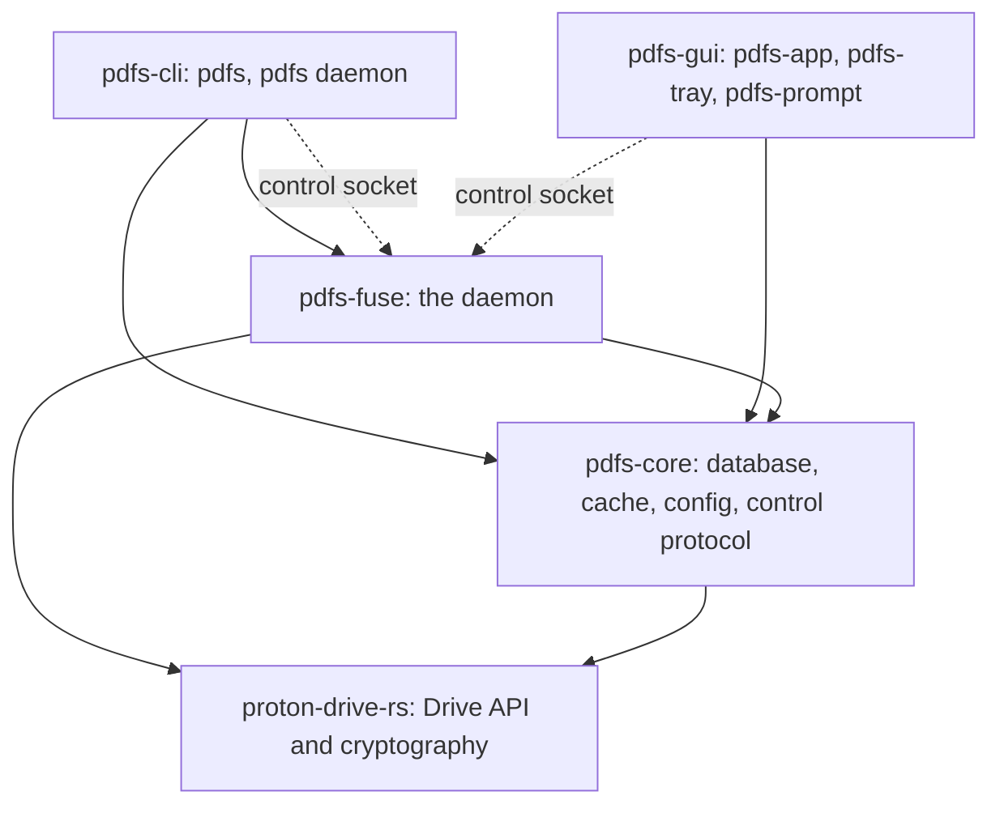
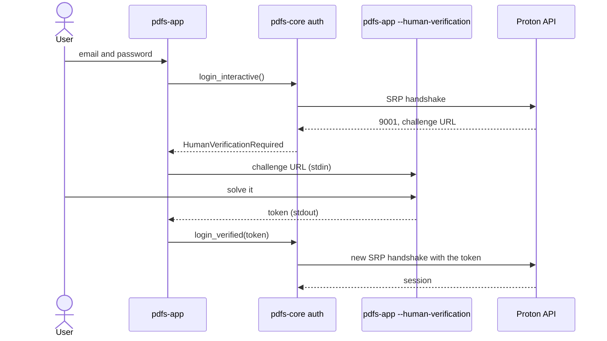

# Architecture

How the Proton Drive Linux client is built: the crates, the local tree behind the mount, the read
and write paths, the queue that sends changes to Drive, the sync engine for synced folders, the
control protocol, the threads, and what the client writes to disk in plaintext. It is written for
contributors and for anyone auditing the client. User documentation starts at
[docs/README.md](README.md).

Numbers quoted here (thread counts, timeouts, limits) are constants in the source. When they
disagree, the source is right.

- [1. Crates and processes](#1-crates-and-processes)
- [2. The local tree](#2-the-local-tree)
- [3. Read path](#3-read-path)
- [4. Write path](#4-write-path)
- [5. The queue and the drain](#5-the-queue-and-the-drain)
- [6. Remote changes](#6-remote-changes)
- [7. Synced folders](#7-synced-folders)
- [8. Control protocol](#8-control-protocol)
- [9. Threads](#9-threads)
- [10. Threat model: what this client writes to disk in plaintext](#10-threat-model-what-this-client-writes-to-disk-in-plaintext)
- [11. Sign-in and CAPTCHA](#11-sign-in-and-captcha)
- [12. Feature notes](#12-feature-notes)
- [13. Where it is going](#13-where-it-is-going)

---

## 1. Crates and processes

```mermaid
graph TD
    CLI["pdfs-cli: pdfs, pdfs daemon"]
    GUI["pdfs-gui: pdfs-app, pdfs-tray, pdfs-prompt"]
    FUSE["pdfs-fuse: the daemon"]
    CORE["pdfs-core: database, cache, config, control protocol"]
    SDK["proton-drive-rs: Drive API and cryptography"]

    CLI --> FUSE
    CLI --> CORE
    GUI --> CORE
    FUSE --> CORE
    FUSE --> SDK
    CORE --> SDK
    CLI -.->|control socket| FUSE
    GUI -.->|control socket| FUSE
```

| Crate | Holds |
|---|---|
| [`pdfs-core`](../crates/pdfs-core) | Authentication and keyring (`auth`), configuration and directories (`config`), the SQLite schema and queries (`db/`), the content cache (`cache`), the control protocol (`control`), search scoring, ignore rules, Google Takeout parsing, the machine profile |
| [`pdfs-fuse`](../crates/pdfs-fuse) | The daemon: FUSE handlers (`filesystem`), the tree (`state`), reads (`reads`), the queue and the drain (`queue`, `drain`, `upload`), the link state (`link`), remote events (`background`), the sync engine (`sync`, `sync/`), moves between locations (`relocate`), control handlers (`control`), push events (`events`), photos, sharing, devices, the supervisor, and the simulation tests (`sim/`) |
| [`pdfs-cli`](../crates/pdfs-cli) | The `pdfs` binary. `pdfs daemon` runs the daemon in-process; every other command is a control-socket client |
| [`pdfs-gui`](../crates/pdfs-gui) | `pdfs-app`, `pdfs-tray` and `pdfs-prompt`. Pages in `src/app/pages/`, widgets in `src/app/widgets/`, CSS and icons in `resources/` |

The daemon runs as the systemd user unit `proton-drive.service`. Only the daemon holds the
database, the caches and the API client. Every other program is a client of its control socket
(§8) and never opens the database or calls Drive itself.

---

## 2. The local tree

### Nodes and local ids

Every node the daemon knows is a row in the `nodes` table of `cache.db`. Each row has a **local
id** (`lid`), given when the row is made and never changed. Rows link to their parent by
`parent_lid`, so a folder's children, its subtree and its ancestors are found by local id.

- **Inode = local id.** A node's inode is `lid + 1` (`lid_ino` in `state.rs`). It is the same in
  every mount and after a restart, so the kernel's cached entries never point at an inode the
  daemon has forgotten.
- **Nodes made here.** A node created on this machine has no Drive uid until its create lands. It
  goes by the stand-in `local~<lid>` (`db::local_uid`), a function of its row. When the create
  lands, the row gets the real uid in the same transaction.
- **One tree for every mount.** The daemon holds one in-memory `State`, a cache of the `nodes`
  table. `~/ProtonDrive` and each online-only synced folder are FUSE sessions rooted at different
  nodes of that tree; each session calls its own root inode 1 and translates at the kernel
  boundary.

### Listings on demand

A folder is listed from Drive the first time it is opened. `ensure_children` checks the folder's
`listed` flag. If it is set, the children come from the database. If not, the daemon enumerates
the folder from Drive, writes the children to the database, sets the flag, and interns them.

### Access

Every entry carries an `Access` (`Owner`, `Editor`, `Viewer` or `Unknown`). It is inherited from
the parent when the entry is interned. A share root takes its access from the persisted
`share_access` table, which also keeps the classification right offline. Two rules cover what
inheritance cannot:

- **Not under a share, no role: `Owner`.** My files and device folders are the user's own.
- **Under a share, no usable role: `Viewer`.** An unknown permission mask is never guessed upward.

A node whose parent is not resident resolves as `Db::effective_node_access` does: a recorded share
above it wins; otherwise it is writable on the mount's own volume and read-only on a foreign one
(`docs/BUGS.md` B79).

Writes are refused in three layers:

1. **Mode bits.** A non-writable entry reports `0o555` or `0o444`, and every mount sets
   `DefaultPermissions`, so the kernel refuses writes from any non-root process.
2. **Handler checks.** `create`, `mkdir`, `unlink`, `rmdir`, `rename` (both parents), and opens
   for writing, `write`, `setattr` and `fallocate` answer `EACCES`. This covers root and stale
   attribute caches.
3. **Queue guard.** `Core::require_uid_writable` admits a change only when the database and the
   live tree both agree the node is writable. Nothing reaches the queue otherwise, so a refused
   write cannot become an op that fails forever (`docs/BUGS.md` B34).

`EACCES`, not `EROFS`: a read-only subtree inside a read-write mount is not a read-only
filesystem, and `EROFS` misleads `cp`, `rsync` and `git`.

### Locations

The `mount` table has one row per local place the daemon occupies: My files and each synced
folder, in either mode. It serves `pdfs locations` and the app. A mirrored folder is an ordinary
directory with no FUSE session, which is why the table speaks of locations, not mounts. The My
files mountpoint stays in `config.json`; its row is written at start as a copy of it.

---

## 3. Read path

`Core::read_range` serves a read from the revision's content blocks. It looks in three places
before the network:

1. **Whole-file blob.** A file kept available offline is downloaded completely into the content
   cache and read from there.
2. **Stream ring.** An in-memory ring of recently decrypted blocks (`RING_BYTES`, 128 MiB). The
   kernel reads in pieces far smaller than a block.
3. **Block cache.** Blocks on disk under `content/blocks/`. They count against `cache_budget` and
   are evicted least recently used first.

On a miss, only the blocks that overlap the request are fetched, through a `RevisionReader` kept
open per revision (`MAX_OPEN_READERS = 64`). A fetch that cannot finish within
`READ_FETCH_TIMEOUT` (120 s) fails the read with `EIO`.

- **Block geometry.** The first read of a file plans on uniform 4 MiB blocks (`BLOCK_SIZE`). Once
  a reader is open, the real block sizes are stored (`store_block_geometry`) and later reads plan
  on them. Proton does not guarantee 4 MiB blocks (`docs/BUGS.md` B85, B87).
- **Read-ahead.** A sequential reader gets 2 to 8 blocks of prefetch (`PREFETCH_MIN`,
  `PREFETCH_MAX`). Prefetch takes a permit from a budget of 8 (`PREFETCH_BUDGET`) and gives up
  instead of waiting, so it never delays a read someone asked for.
- **Large videos.** An unpinned video of 256 MiB or more (`STREAM_BYPASS_MIN`) streams without
  storing its blocks, so watching a film does not evict the rest of the cache.

A file open for writing is read from its handle: written bytes from the scratch file, the rest
from its base.

---

## 4. Write path

Since 3.0.0 the mount is **local-first**. A syscall changes the local tree and the queue, and
returns. It does not wait for Drive, except to read content that is not cached. Being offline
only means more work is queued.

### Namespace changes

`mkdir`, `create`, `rename`, `unlink` and `rmdir` through the mount:

| Call | What happens locally | Queued op |
|---|---|---|
| `mkdir`, `create` | A new row under `local~<lid>` (`queue_local_node`) | `mkdir` or `create` |
| `rename` | The node moves in the tree at once (`queue_rename`) | `rename`, holding the end state and the node's original parent and name |
| `unlink`, `rmdir` | The node leaves the tree; ops queued for it are dropped (`queue_trash`) | `trash`, or nothing for a node Drive never saw |

A rename or move asked for over the control socket (`pdfs rename`, `pdfs move`, the app) is queued
the same way, and always when the node already has something queued, so it cannot overtake it
(`docs/BUGS.md` B149).

`"local_first": false` in `config.json` brings back the old path for this release: while online,
these calls go to Drive inside the syscall. It is removed in the next release (§13).

### Content

1. **Open for writing.** A `WriteHandle` with a scratch file under `content/scratch/`. An interval
   set records which bytes were written; reads of the rest go to the base.
2. **Release** (`close(2)` of the last handle). Gaps the program did not write are filled from the
   base, from the cache when it has them. The scratch file and its metadata are published into
   `content/staging/` (fsync, atomic rename, directory fsync), and a `revision` op is queued in
   the same transaction that supersedes an older one. A new file's bytes ride on its `create` op
   instead.
3. **Debounce.** A `revision` op waits `DRAIN_REVISION_DEBOUNCE` (2 s) before it is sent, so a
   quick follow-up write replaces it in the queue. Once a file has been uploaded, the wait widens
   toward how long that upload took, up to `DRAIN_REVISION_DEBOUNCE_MAX` (60 s)
   (`Core::revision_debounce`).
4. **Cancel.** Before the queue is touched, `Core::cancel_upload` stops an upload already reading
   the blob that is being replaced.

`fsync` means "durable locally". Writes that were fsynced but not yet released when the daemon
died are found at the next start (`recover_fsynced_writes`), kept in `content/recovery/`, and
queued.

### Transient names

A file under a scratch name, such as a browser's `.crdownload` or `.part`, or an editor's `.swp`,
is created locally and its op is **parked** (`PARK_UNTIL`). The rename to the finished name
releases it, so only the finished file reaches Drive (`docs/BUGS.md` B70). A park still standing
after an hour (`PARK_EXPIRY_MS`) is released anyway: bytes the user can see are bytes the user
expects on Drive.

---

## 5. The queue and the drain

### Ops

The queue is the `pending_op` table. An op is a change accepted locally that Drive has not seen
yet.

| Kind | Does | Carries |
|---|---|---|
| `create` | Makes a file | Parent and name; the staged bytes |
| `mkdir` | Makes a folder | Parent and name |
| `revision` | Uploads new content | The staged blob and the revision it was based on |
| `rename` | Moves and renames | The end state (parent, name), and the original parent and name |
| `trash` | Trashes a node | Its name |

Each op names its node and parent by local id (`lid`, `parent_lid`) as well as by uid.
`revision`, `rename` and `trash` describe an end state, so a newer one replaces an older one for
the same node (`op_supersedes`). `create` and `mkdir` are never replaced.

### Two invariants

From `drain.rs`:

1. **A staged blob is the only copy of the user's bytes.** It is deleted only after its op has
   provably landed, never on a path that may be retried.
2. **A failure never stops the queue.** A failed op gets a later `next_attempt_at` (exponential
   backoff), so one stuck file cannot hold up the others.

### The drain

`DRAIN_WORKERS = 16` threads share the queue. A worker takes work with
`Db::claim_next_due_op`, which selects and marks an op in one transaction. It skips an op when:

- it is not due yet (debounce, backoff, or parked);
- another worker holds an op for the same node, so each node's ops land in the order they were
  made;
- its parent is still a `local~` stand-in, so a child's create waits for its folder's create.

A worker that lands an op wakes the idle ones, because the landing may make other ops claimable.
Claims are process-local: the database is single-writer (a `flock`), so a claim found at start
belongs to a crashed run and `Db::clear_op_claims` drops it.

A landing create records the real uid on the node's row. Ops inside a landed folder need no
rewrite: they find the parent's uid through `parent_lid`.

### Conflicts

A `revision` op stores the revision it was based on. If Drive's current revision differs and is
not one this daemon sealed itself (`own_sealed_rev` table), the queued bytes are kept as a
conflict copy (`Core::revision_conflict`) next to the remote version. A name taken on Drive by a
node this machine has not seen lands under a conflict name too. Both go to the activity log.

Conflict copies are named `{stem} (sync-conflict {unix_secs}).{ext}`.

### Failures and sync issues

An op that has failed `FAILING_ATTEMPTS` (6) times counts as failing. An op that Drive refused
gets a **sync issue** at once, stored on the op:

| Issue | Meaning |
|---|---|
| `quota` | The account's storage is full |
| `access` | The account may no longer change the node, for example a revoked share |
| `missing` | The node or its folder is gone from Drive |
| `limit` | Too many items in the folder, or nested too deep |
| `rejected` | Drive refused the change, for example a name it does not accept |

The op stays queued and keeps retrying; nothing is deleted. The user sees the issue in
`pdfs sync issues`, the tray, **Sync → Overview**, and as a badge on the node in the file browser.
They can save the content (`pdfs sync export`) or drop the change and undo it locally
(`pdfs sync discard`). Only a discard the user asks for removes an op.

### Link state

`link.rs` tracks whether Drive is reachable. A network error marks the daemon offline, and a probe
thread (`pdfs-online-probe`) backs off until a request succeeds. Remote calls a caller waits on
have a deadline (`INTERACTIVE_CALL_TIMEOUT`, 20 s); uploads get one that grows with their size
(`link::upload_deadline`).

---

## 6. Remote changes

`run_event_sync` follows Proton's event stream for the Drive volume. Each event updates the
database and the tree, and the kernel is told about entries that changed. The cursor is stored as
events are applied, so changes made while the daemon was stopped arrive at the next start. An
event for a revision in `own_sealed_rev` is our own echo, not a change from elsewhere.

`run_photos_event_sync` follows the photos volume with its own cursor. Photos are not in the mount,
so it only drops gallery rows or marks the timeline stale (`TIMELINE_TTL`, 60 s).

`pdfs refresh` drops a cached listing so the next read fetches it again.

---

## 7. Synced folders

A synced folder in **mirror** mode is a plain local directory kept in step with a folder under
this computer's device in Drive. It has its own engine (`sync.rs`, `sync/`); it does not use the
queue of §5 yet (§13). A folder in **online-only** mode is a FUSE session on the tree (§2), and
its changes go through the queue like My files.

### A sync pass

A filesystem watcher (`notify`) and a remote poll every 120 s feed a debounced pass (2 s, at most
30 s). Passes are serialized per daemon. A pass:

1. **Walks the local tree.** A path the user may not read, an entry that vanishes mid-scan and a
   name that is not UTF-8 are left out, and the pass drops everything under them, as it drops
   ignored paths, so a left-out path is never read as deleted. An unreadable root and any other
   I/O error fail the pass.
2. **Walks the remote tree.**
3. **Loads the baseline**, the `sync_entry` rows: both sides as of the last successful pass.
4. **Classifies each path** by comparing local, remote and baseline, with `(mtime, size)` as the
   change signal:

   | Local | Remote | Action |
   |---|---|---|
   | changed | unchanged | upload |
   | unchanged | changed | download |
   | changed | changed | conflict: the local file becomes a conflict copy, the remote one is downloaded |
   | deleted | unchanged | trash on Drive |
   | unchanged | deleted | delete locally |
   | new | — | upload as new |
   | — | new | download as new |

5. **Applies** the actions, folders before their contents, a few at a time.
6. **Settles.** The baseline is updated from what actually happened. A failed local delete or
   conflict copy keeps the old baseline.

Safety rules:

- **Wipe guard.** A pass in which every previously synced file has vanished locally is refused
  instead of trashing the whole folder on Drive. It applies to any non-empty baseline.
- **Open for writing.** Files that some process holds open for writing (`/proc/*/fd`,
  `open_for_write_set`) are left out of the pass and picked up after they are closed.
- **Ignore rules.** `.pdfsignore` (or `.protonignore`) at the folder root plus `ignore_patterns`
  from `config.json`, in gitignore syntax. Ignoring never deletes.

### Moves between locations

My files and each online-only folder are separate FUSE sessions, and a mirrored folder has none,
so the kernel answers `rename(2)` between them with `EXDEV` and `mv` copies and deletes. On Drive
the same move is one `move_node`. `Request::Move` with two absolute paths (`pdfs move`, the app)
is resolved against every location by `Core::move_between` (`relocate.rs`):

- **Nothing that exists only on this disk may be lost.** A mounted source is refused while it or
  anything under it is queued or open for writing. A mirrored source is refused unless every file
  under it matches its baseline (`mirror_subtree_unsynced`); ignored files and symlinks count as
  unsynced.
- **Mirror to mirror** renames the local copy with `RENAME_NOREPLACE` and moves its baseline rows
  (`sync_entries_move`), so neither folder's next pass has work. A failed `move_node` undoes the
  rename.
- **Passes are held off.** Every mirrored folder involved is locked by ascending id, for at most
  five seconds.
- **No downloads for what is cached.** A mirrored destination that has to download the node first
  copies cached blocks into place (`ContentCache::copy_cached_to`).

### Devices and the machine profile

Synced folders live under a **device**, a per-computer root in Drive. `Core::ensure_device` picks
this machine's device: the adopted `device_uid` from `config.json` when set, else a Linux device
named like the hostname, else a new one. An adopted uid that no longer exists is reported, never
replaced silently.

The local database does not survive a lost machine, so the daemon backs up its arrangement to
`<device root>/.proton-drive-linux/profile.json` (`pdfs_core::profile`): each synced folder's
remote uid, local path and mode, the pins, and the ignore patterns. It is uploaded like any other
file, so it is end-to-end encrypted. `Core::touch_profile` coalesces bursts of changes into one
upload. `PROFILE_VERSION` guards the format: a profile from a newer client is refused, not applied
in part.

Restore lists the device's folders, proposes a local path from the profile, and on confirmation
adds a synced folder bound to the remote uid. The download is an ordinary pass against an empty
baseline. The user side is in [RECOVERY.md](RECOVERY.md).

---

## 8. Control protocol

Front ends talk to the daemon over a Unix socket, `control.sock` in the state directory
(`pdfs_core::control`).

- **Framing.** One JSON `Request` per line, one JSON `Response` per line.
- **Limits.** A request is at most 1 MiB, must end with a newline, and must arrive within 10 s. At
  most 64 handlers run at once.
- **Client timeouts.** 2 s to write a request; 120 s to read the answer; 5 s for a status poll,
  which is what the app shows as "Not responding".
- **Errors.** `Response::Error { message, kind }`. The `kind` is machine-readable, and
  `pdfs --json` passes it through.
- **Compatibility.** After an upgrade the old daemon runs until the service restarts, so a front
  end must cope with a daemon that does not know a newer request. The daemon answers such a
  request with an error instead of closing the connection. New fields get `#[serde(default)]`;
  new behaviour gets a new request rather than an optional field an old daemon would ignore.

### Push events

The app and the tray send `Request::Subscribe` once and keep the connection open. The daemon then
streams one `Event` per line:

| Event | Sent when |
|---|---|
| `Status` | On subscribe, and whenever a status field changes |
| `Transfers` | On subscribe, and whenever the transfer list changes |
| `Changed { topics }` | Something a page shows changed. Topics: `files`, `photos`, `trash`, `shares`, `devices`, `locations`, `queue`, `conflicts`, `activity` |
| `Heartbeat` | After 10 s of silence |

Code that changes state publishes topics to the `EventHub` (`events.rs`); the control handler
lists the topics each mutating request touches. Changes within 150 ms are coalesced. A new
subscriber is told every topic changed. At most 8 subscriptions are served at once.

`pdfs_core::control::follow` reconnects across daemon restarts with backoff and treats 25 s
without a line as a stuck daemon.

### Search

`SearchV2` carries the query, a limit, the sources (`Drive`, `Local`) and a content kind. The
daemon searches Drive metadata and its index of the home directory (`pdfs-localindex`), and scores
both with `pdfs_core::search::relevance_score`, so the prompt can merge them into one list.

---

## 9. Threads

| Thread | Does |
|---|---|
| FUSE dispatch loop, one per session | Reads kernel requests. Cheap ones are answered inline; the rest go to the worker pool |
| FUSE workers (`FUSE_WORKERS = 11`) | Handlers that may touch the network. 3 serve metadata only (`lookup`, `readdir`, namespace changes), so a listing never waits behind block downloads; 8 prefer transfers and help with metadata when idle |
| `pdfs-drain-0` … `pdfs-drain-15` | The drain (§5). Worker 0 also runs the queue's idle chores |
| `pdfs-control` | Accepts control connections; at most 64 handlers |
| `pdfs-events` | Publishes status, transfer and topic changes to subscribers |
| `pdfs-sync`, `pdfs-sync-poll` | Mirror passes and the remote poll (§7) |
| Tokio runtime | Remote calls, and the Drive and photos event streams (§6) |
| `pdfs-online-probe` | Probes Drive while offline |
| `pdfs-supervisor` | Logs workers that hold one job for minutes, a queue that stops draining, and control requests that never return; samples memory; pings the systemd watchdog only after a round trip over the control socket succeeds (`WatchdogSec=120`) |
| `pdfs-conflict-sweep` | Optional. After 30 s, then every 5 minutes, finds `(sync-conflict …)` copies identical (size and SHA-1) to their original. `conflict_sweep` decides: `off`, `report` (default) or `enforce`, which trashes them after re-checking each one |
| Smaller helpers | `pdfs-localindex` (home index for search), `pdfs-pause` (ends a timed pause), `pdfs-similar` (similar photos, on request), `pdfs-diagnostics` |

Long-running loops wait on one shared `Shutdown` signal instead of sleeping, so a stop joins them
instead of leaving them behind (`docs/BUGS.md` B44). `pdfs diagnostics` reports what each worker
is doing.

---

## 10. Threat model: what this client writes to disk in plaintext

Proton Drive is end-to-end encrypted: the server never holds the keys to your content. That
property ends at this daemon. Serving a file through a POSIX filesystem means producing
plaintext, and serving it quickly means keeping some of it. This section states exactly what lands
on disk.

**The short version: the cache and state directories hold decrypted content and decrypted
metadata. This client assumes the disk under them is encrypted (LUKS, or an encrypted home).** On
an unencrypted disk, someone with the powered-off machine can read cached files and the names and
structure of your whole Drive without your password.

### 10.1 Decrypted content

Everything under `$XDG_CACHE_HOME/proton-drive-linux/content/` is plaintext:

| Path | Holds | Kept until |
|---|---|---|
| top level | Whole files: available offline, or opened whole | Evicted, or unpinned |
| `blocks/` | Blocks of partly read files | Evicted |
| `thumbs/` | Thumbnails and previews | Evicted |
| `scratch/` | Files open for writing | Released, or rescued at the next start |
| `staging/` | Released writes waiting to upload | **The upload lands** |
| `recovery/` | Fsynced writes rescued after an unclean stop | **Queued into `staging/`** |

`staging/` and `recovery/` are not copies of something Drive has. They hold content that may exist
nowhere else yet, so they are never cleared at start or by a cache purge. They are both the most
sensitive data on disk and the data that must not be deleted to free space.

### 10.2 Decrypted metadata

`$XDG_STATE_HOME/proton-drive-linux/cache.db` is a plain SQLite database. It holds decrypted node
names, the folder tree, sizes, timestamps, a trigram index over names, the activity log, the
photos timeline and the queue. It is not evicted and not budgeted. Clearing the cache does not
touch it.

`sdk_cache.db` holds the SDK's decrypted node metadata, encrypted at rest with a key from the
mailbox password (§12).

### 10.3 What is not written in plaintext

Credentials. The session (access and refresh tokens and the key material needed to resume) is
stored only in the system keyring through the Secret Service (`auth.rs`). `config.json` holds
settings and uids, no secrets.

The control socket is a credential of another kind: anything that can connect to `control.sock`
can drive the daemon (list and read, upload, trash, create public links) without the keyring. See
§10.5.

### 10.4 Memory, swap and the page cache

Two exposures this client does not mitigate:

- **Swap.** Keys and decrypted buffers live in ordinary heap memory. Nothing calls `mlock(2)`, so
  they can be paged out. Use encrypted swap.
- **Kernel page cache.** Plaintext returned through FUSE is cached by the kernel like any file
  data, and can be swapped. Avoiding that would mean `direct_io` on every read and losing the
  kernel's read-ahead and caching. The client takes the performance.

### 10.5 Ownership and file modes

At every start, `AppDirs::ensure` checks that the config, state and cache directories are real
directories owned by the user, refuses symlinks and other owners, and sets mode `0700`. The control
socket is set to `0600` right after it is bound (`restrict_socket`); if that fails, the daemon
does not serve.

| Artifact | Why it is restricted |
|---|---|
| `content/` | Another local user could read cached file content |
| `cache.db` | Another local user could read the names and structure of your Drive |
| `control.sock` | **Another local user could drive the daemon** with your session |

`config.json` is written to a restricted temporary file, synced, renamed into place, and the
directory synced. A config file that cannot be parsed is reported and left alone, never replaced
with defaults.

### 10.6 What follows

- Treat the cache and state directories as being as sensitive as your Drive.
- Restored or copied state must stay owned by the user, or the daemon refuses to start.
- `pdfs cache clear` removes cached content, not `cache.db`, and never removes unsent `staging/`
  or `recovery/` content.

[RECOVERY.md](RECOVERY.md) covers what a lost machine means for this data and what to revoke.

---

## 11. Sign-in and CAPTCHA

Proton may answer a sign-in from an unfamiliar network or a VPN with a human verification
challenge (API error 9001).

```mermaid
sequenceDiagram
    actor User
    participant UI as pdfs-app
    participant Auth as pdfs-core auth
    participant Web as pdfs-app --human-verification
    participant API as Proton API

    User->>UI: email and password
    UI->>Auth: login_interactive()
    Auth->>API: SRP handshake
    API-->>Auth: 9001, challenge URL
    Auth-->>UI: HumanVerificationRequired
    UI->>Web: challenge URL (stdin)
    User->>Web: solve it
    Web-->>UI: token (stdout)
    UI->>Auth: login_verified(token)
    Auth->>API: new SRP handshake with the token
    API-->>Auth: session
```

- The challenge used up the first SRP handshake, so the retry starts a new one with the token
  attached.
- The page may post the token as an object or as a JSON string; both are accepted.
- The page runs in a WebKitGTK view inside a child `pdfs-app`. WebKit aborts its process when its
  sandbox cannot start, as on hardened systems such as secureblue (B195). In the child, that ends
  the verification, and the app says why, instead of closing the app.
- The CLI has no web view. It fails with a message to sign in once with `pdfs-app`; the stored
  session then works for the CLI and the service.

---

## 12. Feature notes

Features whose code is shaped by a constraint that the code alone does not explain.

### Version history

`revisions.rs`, `versions_dialog.rs`. `ListRevisions`, `RestoreRevision`, `DeleteRevision` and
`SaveRevisionAs`, each with a `…ByUid` twin for nodes no mount can name.

- **A restore runs on the server, later.** Drive answers 202 and swaps the active revision in the
  background. No content is sent and nothing is queued; the daemon evicts the file's cached
  blocks and readers, and the app promises the request, not the result.
- **The active revision cannot be deleted.** Checked locally, so the user gets a sentence instead
  of an API code.
- **Saving a version never overwrites.** An existing destination is refused, and a partial file is
  removed when the download fails.

### Photos

`pdfs-fuse/src/photos.rs`, `pdfs-core/src/db/photos.rs`, `pdfs-gui/src/app/pages/photos.rs`.

- **Favorites** use the SDK's photo tags. Favoriting a photo that is not on the account's own
  photos volume (shared, or only in an album) is refused: it would need re-encryption the SDK does
  not offer.
- **RAW + JPEG** pairs share a `group_key`. The server's relation (`main_photo_uid`,
  `related_photo_uids`) comes first; otherwise the same capture day and name stem with one member
  raw. The tile shows the non-raw member. Trashing a tile trashes the whole group. Albums are
  never grouped.
- **The gallery** lays each day out in justified rows (`justify_rows`), so every tile has its
  photo's shape.
- **Delete** is by uid (`Request::TrashNodes`), because the photos volume is not in the mount. The
  rows are dropped at once, and the app offers Undo.

### SDK entity cache

`sdkcache.rs`. The SDK's cache of decrypted node metadata is stored in `sdk_cache.db`, so a restart
does not fetch and decrypt the tree again.

- **Its own file**, not `cache.db`: the traffic is frequent, small and can be rebuilt, and it needs
  no migrations. It may be deleted while the daemon is stopped.
- **Encrypted at rest** with the SDK's `EncryptedCacheRepository`, keyed by the mailbox password.
  After a password change it reads as empty.
- **Staleness** is handled by the event stream (§6). When the cursor has to be seeded (first
  mount, or a lost cursor), the store is cleared. Signing out deletes it.

### Batched calls

`batch.rs`. `trash_nodes`, `restore_nodes` and `delete_nodes` report one outcome per node;
`batch::into_unit` turns a single-node call back into a `Result`. A restore first adds every
trashed ancestor and descendant of what was asked for, from the trash listing (`expand_restore`),
and sends them shallowest first, because Drive cannot restore a node into a parent that is still
trashed. Restore and permanent delete from the Trash page use the streaming variants and update
local state per node as each batch lands.

---

## 13. Where it is going

3.0.0 made the mount local-first. What is still split:

- **The old online path** in `filesystem.rs` and the `local_first` switch go in the next release.
- **Remote changes** are applied by the event code and by several invalidation helpers. One
  applier for everything that comes from Drive is the next step.
- **Mirrored folders** still have their own engine (§7). They move onto the local tree and the
  queue after that.

[ROADMAP.md](ROADMAP.md) tracks these and the rest of the planned work.
